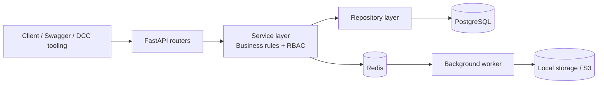
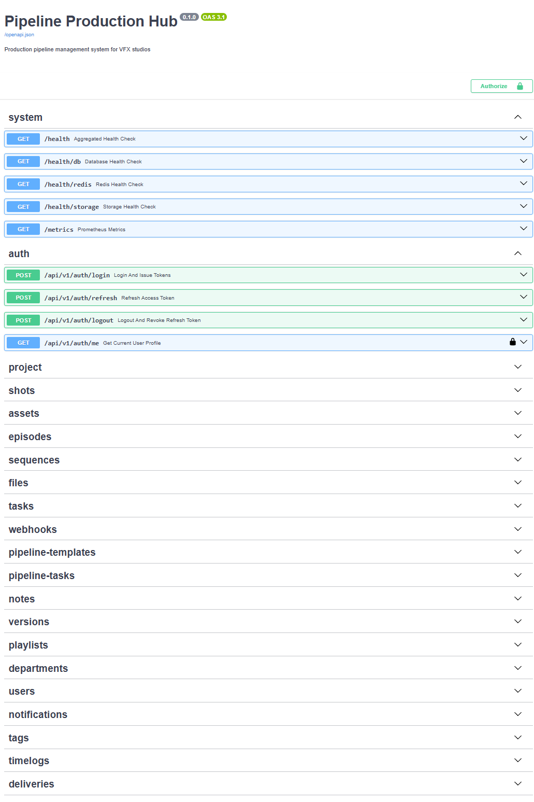
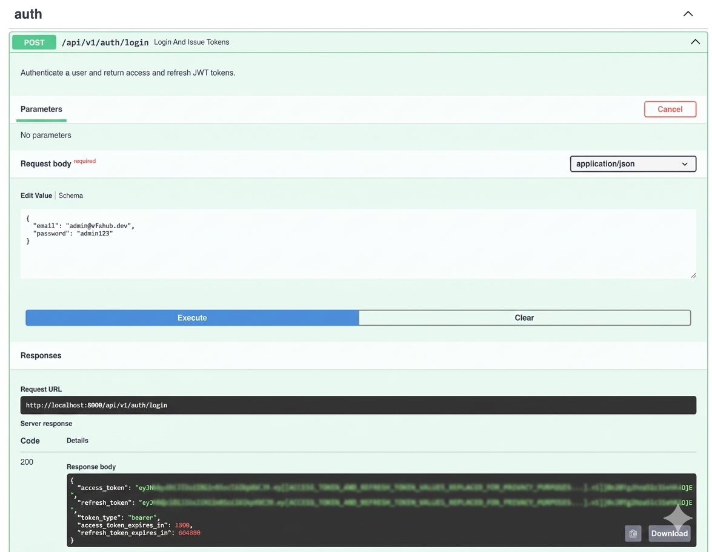
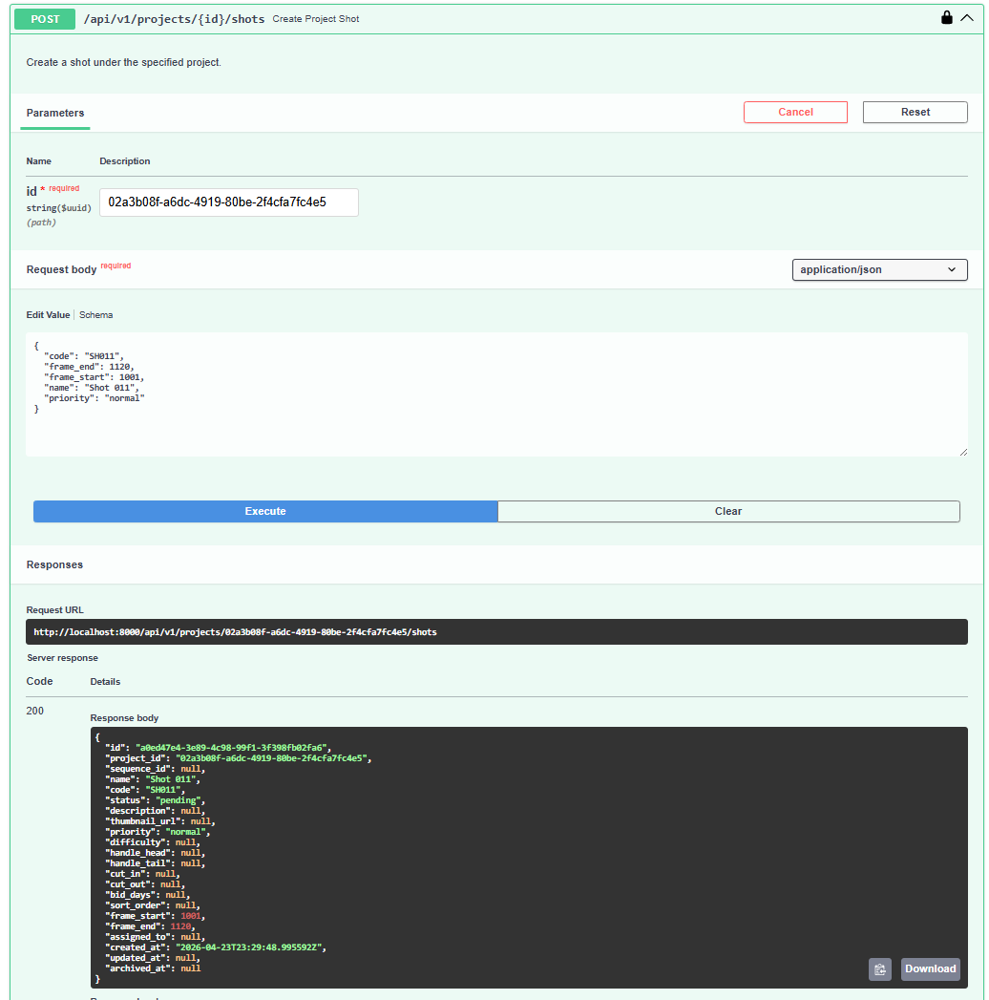
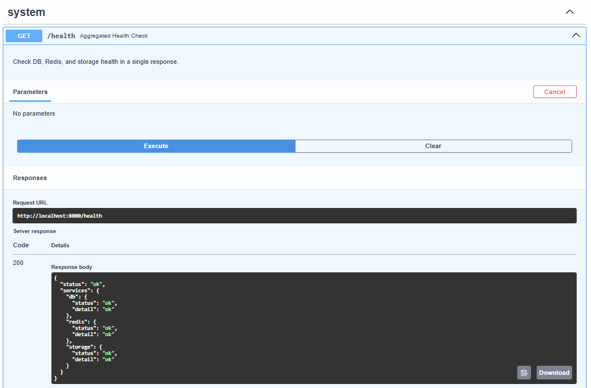

# Pipeline Production Hub

> Production pipeline management system for VFX studios


---

## What this is

Pipeline Production Hub is a backend REST API that manages the full production lifecycle of creative projects: shots, assets, departments, pipeline tasks, client deliveries, hour tracking, and internal reviews.

It was built as a portfolio project demonstrating production-grade patterns in FastAPI — async-first architecture, layered service design, RBAC, structured logging, Prometheus metrics, and pluggable cloud storage. The system is flexible enough to support VFX studios, game development pipelines, animation houses, and other media production workflows.

In one quick pass:

- **Problem**: creative production data is spread across shots, assets, task status, reviews, files, and deliveries, which makes coordination fragile without a central backend.
- **Audience**: pipeline TD, backend, and technical artist interview loops, plus studios that need a compact production-management API example.
- **Stack**: FastAPI, PostgreSQL, Redis, SQLAlchemy 2, Alembic, Docker Compose, Pytest, Ruff, and MyPy.
- **What it demonstrates**: layered backend architecture, async I/O, auth and RBAC, background jobs, storage abstraction, observability, and DCC-facing pipeline examples.

---

## Portfolio Context

This project is designed to show the intersection of backend engineering and production pipeline thinking:

- **Backend engineering**: async API design, service and repository layering, migrations, validation, and test automation.
- **Pipeline workflows**: shots, assets, versions, playlists, deliveries, review notes, and department-oriented tasks.
- **Production tooling**: background exports, Redis-backed jobs, structured logs, metrics, and storage backends.
- **Artist-facing integration**: DCC publish examples for Maya, Houdini, Nuke, and standalone tooling under `examples/dcc/`.

---

## Architecture Summary



- FastAPI routers handle HTTP contracts, dependency injection, and request validation.
- Services own business rules, authorization, and orchestration across domains.
- Repositories isolate persistence details for PostgreSQL-backed entities.
- Redis supports token invalidation, rate limiting, and background job coordination.
- A dedicated worker handles longer-running tasks outside the request-response cycle.

For the full technical reference, see [Architecture Docs](./docs/architecture/README.md).

---

## Tech Stack

| Layer            | Technology                                           |
| ---------------- | ---------------------------------------------------- |
| Framework        | FastAPI + Uvicorn                                    |
| Database         | PostgreSQL 16 (async via `asyncpg`)                  |
| ORM / Migrations | SQLAlchemy 2.0 + Alembic                             |
| Cache / Queue    | Redis 7 (task queue, token blacklist, rate limiting) |
| Auth             | JWT (access + refresh tokens) + bcrypt               |
| Config           | Pydantic Settings v2                                 |
| Logging          | structlog (structured JSON logs)                     |
| Metrics          | Prometheus + prometheus-fastapi-instrumentator       |
| Containerization | Docker / Docker Compose                              |
| Testing          | Pytest + httpx async client                          |
| Code quality     | Ruff, MyPy, Hatch                                    |

---

## Architecture

```
Client
  │
  ▼
FastAPI Router          ← schema validation, dependency injection
  │
  ▼
Service Layer           ← business logic, RBAC enforcement
  │
  ▼
Repository Layer        ← async SQLAlchemy queries, no business logic
  │
  ├──▶ PostgreSQL       ← persistent state
  └──▶ Redis            ← task queue, token blacklist, rate limit, metrics

Background Worker       ← separate process, consumes Redis queue
  └──▶ Storage          ← local filesystem or S3-compatible
```

All I/O is async. Background jobs (e.g. project exports) are enqueued to Redis and consumed by a dedicated worker process.

---

## Design Highlights

- **Layered architecture** — strict separation: routers handle HTTP, services own business rules, repositories own persistence. No business logic leaks into routes.
- **Async-first** — the main I/O paths use async clients (`asyncpg`, `httpx`, Redis). Some CPU-bound work such as bcrypt password hashing still runs synchronously.
- **RBAC at service layer** — six roles (`admin`, `supervisor`, `lead`, `artist`, `worker`, `client`) enforced in service methods, not middleware, so authorization logic lives next to the domain it protects.
- **Pluggable storage** — `local` and S3-compatible backends behind a common interface; swap with a single `STORAGE_BACKEND` env var.
- **Background jobs via Redis queue** — heavy operations (project exports) are enqueued to Redis and consumed by a dedicated worker, decoupling API response time from job duration.
- **Structured logging + Prometheus** — structlog emits JSON logs; `/metrics` exposes Prometheus histograms and gauges for active users and request latency.
- **DCC integration examples** — publish scripts for Maya, Houdini, Nuke, and a standalone PySide6 GUI, demonstrating the artist-facing side of the pipeline.

---

## Operational Evidence

The current local validation pass covered the following:

- `docker compose up --build` completes successfully
- Alembic migrations apply cleanly to `head`
- demo seed creates usable interview data
- login, refresh, logout, `/health`, and `/metrics` work against a running stack
- representative RBAC checks return expected `403` responses for restricted actions
- project, shot, asset, and file flows were exercised end to end
- local pytest suite passes: `566 passed`

This section is intentionally limited to checks that were validated in the working repository, not aspirational claims.

---

## Visual Walkthrough


*Swagger UI showing the breadth of the API surface across system, auth, and production workflow domains.*


*Login flow returning access and refresh tokens for authenticated API use.*


*Nested project-to-shot workflow showing a real creation request and successful API response.*


*Aggregated health endpoint confirming database, Redis, and storage availability.*

---

## Features

### Core workflow coverage

| Area | What it covers |
|---|---|
| **Auth / RBAC** | JWT access + refresh tokens, Redis blacklist on logout, login rate limiting, and six scoped roles (`admin`, `supervisor`, `lead`, `artist`, `worker`, `client`) |
| **Production structure** | Projects, episodes, sequences, shots, and assets with status tracking, hierarchy, and ownership |
| **Task and review loop** | Pipeline tasks, notes, versions, playlists, and deliveries for artist-to-supervisor workflows |
| **File handling** | Upload, download, checksum, deduplication, version lineage, and local or S3-compatible storage |
| **Planning and tracking** | Departments, tags, time logs, notifications, shot-asset links, and project reports |

### Supporting engineering systems

| Area | What it shows |
|---|---|
| **Background work** | Redis-backed queue plus dedicated worker for heavier operations such as exports |
| **Observability** | Structured logs, Prometheus metrics, and `/health` checks |
| **Developer workflow** | Docker Compose, Alembic migrations, seeded demo data, Bruno requests, smoke coverage, and pytest coverage |
| **Pipeline integration** | DCC-side examples for Maya, Houdini, Nuke, and standalone tooling |

---

## API Example

Against the seeded demo project, list versions already attached to `DEMO`:

```bash
curl -X GET "http://localhost:8000/projects/<demo_project_id>/versions?limit=2" \
  -H "Authorization: Bearer <token>"
```

Representative response:

```json
{
  "items": [
    {
      "id": "7d6eb8c1-3c77-4ea4-93a3-fbe2a6b63c11",
      "project_id": "c3dd0fd8-7f2c-4f9d-a9ad-5f9764420f1e",
      "shot_id": "e3f77bf8-0c91-46c2-a845-31d6bb889db3",
      "pipeline_task_id": "b0dca8c4-3aaf-4d31-a728-25c1b65e0558",
      "code": "SH010-comp-v002",
      "version_number": 2,
      "status": "pending_review",
      "description": "Updated comp pass for Opening Wide",
      "submitted_by": "9c495845-d8d7-48f0-9c6e-cd4d5d9b9469",
      "created_at": "2026-04-20T18:42:11Z"
    },
    {
      "id": "41f7b517-05ba-4b5c-96dd-a7c72f0c362d",
      "project_id": "c3dd0fd8-7f2c-4f9d-a9ad-5f9764420f1e",
      "shot_id": "e3f77bf8-0c91-46c2-a845-31d6bb889db3",
      "pipeline_task_id": "b0dca8c4-3aaf-4d31-a728-25c1b65e0558",
      "code": "SH010-comp-v001",
      "version_number": 1,
      "status": "approved",
      "description": "Initial comp submit for Opening Wide",
      "submitted_by": "9c495845-d8d7-48f0-9c6e-cd4d5d9b9469",
      "created_at": "2026-04-19T09:10:03Z"
    }
  ],
  "total": 2,
  "offset": 0,
  "limit": 2
}
```

Update a seeded shot status during the walkthrough:

```bash
curl -X PATCH http://localhost:8000/shots/<sh030_id>/status \
  -H "Authorization: Bearer <token>" \
  -H "Content-Type: application/json" \
  -d '{"status": "in_progress", "comment": "Starting FX work on the seeded demo shot"}'
```

Full interactive docs at `http://localhost:8000/docs`.

---

## Quick Start

### Start all services

```bash
docker compose up --build
```

Services will be available at:

- **API**: `http://localhost:8000`
- **Interactive docs**: `http://localhost:8000/docs`
- **Metrics**: `http://localhost:8000/metrics`

### Interview demo

For a short recruiter-friendly walkthrough, use [`docs/demo-script.md`](./docs/demo-script.md).

### Apply database migrations

Run this once after the first `docker compose up` (and after any future schema change):

```bash
docker compose exec api alembic upgrade head
```

### Initialize demo data

Seed the database with a complete demo dataset (roles, admin user, demo users, demo project, episodes, sequences, shots, assets, and project role assignments):

```bash
docker compose exec api python -m app.scripts.seed
```

Customize seed values via `.env`:

```
SEED_ADMIN_EMAIL=admin@studio.com
SEED_ADMIN_PASSWORD=changeme
SEED_DEMO_USER_PASSWORD=demo123
SEED_DEMO_PROJECT_NAME=Demo Project
SEED_DEMO_PROJECT_CODE=DEMO
```

### Run tests

Run all tests:

```bash
docker compose exec api python -m pytest -v
```

Run tests by marker:

```bash
docker compose exec api python -m pytest -m projects -v
```

Run specific test file:

```bash
docker compose exec api python -m pytest test/test_projects_endpoints.py -v
```

Run a specific test:

```bash
docker compose exec api python -m pytest test/test_projects_endpoints.py::test_projects_crud_and_delete_admin_only -v
```

Run with coverage report:

```bash
docker compose exec api python -m pytest --cov=backend --cov-report=term-missing
```

### Smoke tests

Fast end-to-end API sanity check against a running stack. Covers all 24 domains.

Run the full suite:

```bash
docker compose exec api python -m smoke_tests.runner
```

Run a single domain (standalone — creates its own prerequisites):

```bash
docker compose exec api python -m smoke_tests.test_08_shots
docker compose exec api python -m smoke_tests.test_12_pipeline_tasks
docker compose exec api python -m smoke_tests.test_24_pipeline_path_isolation
```

Override defaults:

```bash
docker compose exec api python -m smoke_tests.runner \
  --base-url http://localhost:8000 \
  --email admin@vfxhub.dev \
  --password admin123
```

Environment overrides: `SMOKE_BASE_URL`, `SMOKE_EMAIL`, `SMOKE_PASSWORD`, `SMOKE_TIMEOUT_SECONDS`.

---

### DCC integration examples

Thin DCC-side publish examples live under `examples/dcc/`.

- generic artist CLI publish flow
- Nuke-oriented publish flow with live or mock DCC context

Start here: [`examples/dcc/README.md`](./examples/dcc/README.md)

---

## Future Work

- add a small frontend or review dashboard on top of the current API surface
- expand background workers beyond exports and file post-processing into more production automation
- add deeper audit trails, notifications, and cross-project reporting for studio-scale scenarios
- publish a short recorded walkthrough alongside the written demo script

---

### Code quality (lint, format, type check)

Run linter:

```bash
docker compose exec api ruff check .
```

Format code:

```bash
docker compose exec api ruff format .
```

Type checking:

```bash
docker compose exec api mypy backend
```

Run all checks:

```bash
docker compose exec api bash -c "ruff check . && ruff format . && mypy backend && python -m pytest -v"
```

---

## Environment

Copy `.env.example` to `.env` and fill in the values. Key variables:

| Variable             | Description                                       |
| -------------------- | ------------------------------------------------- |
| `DATABASE_URL`       | Async PostgreSQL URL (`postgresql+asyncpg://...`) |
| `REDIS_URL`          | Redis connection string                           |
| `JWT_SECRET`         | Secret key for signing JWTs                       |
| `STORAGE_BACKEND`    | `local` (default) or `s3`                         |
| `LOCAL_STORAGE_ROOT` | Base path for local file storage                  |
| `S3_BUCKET`          | S3 / MinIO bucket name                            |
| `S3_ENDPOINT_URL`    | Custom endpoint for MinIO / LocalStack            |

---

## Project Structure

```
pipeline-production-hub/
├── backend/app/
│   ├── api/routes/         # FastAPI routers, one per domain
│   ├── services/           # Business logic and RBAC orchestration
│   ├── repositories/       # Async SQLAlchemy persistence layer
│   ├── models/             # SQLAlchemy ORM models
│   ├── schemas/            # Pydantic request/response contracts
│   ├── core/               # Config, security, logging, metrics, exceptions
│   └── scripts/            # Seed script, background task worker
├── backend/alembic/        # Database migration versions
├── test/                   # Pytest test suite
├── examples/
│   └── dcc/                # Portfolio-oriented DCC / artist publish examples
├── docs/                   # Public-facing reference and walkthrough docs
├── docker-compose.yml
├── Dockerfile
└── pyproject.toml
```

---

## Documentation

- [Architecture reference](./docs/architecture/README.md)
- [Guided demo walkthrough](./docs/demo-script.md)
- [DCC integration examples](./docs/dcc-integration.md)
- [Testing and validation notes](./docs/testing-workflow.md)

---

## Scope And v1 Boundaries

- This project is a backend-first portfolio piece, not a full production deployment for a studio.
- The public repository may show a curated subset of the full day-to-day development history.
- DCC examples are integration-oriented samples, not packaged production plugins.
- The goal is to show credible architecture and workflow coverage rather than every possible studio-specific edge case.

---

## License

MIT

## Inspect database (Docker)

Open an interactive PostgreSQL shell:

```bash
# Linux / macOS / Git Bash
docker compose exec db sh -lc 'psql -U "$POSTGRES_USER" -d "$POSTGRES_DB"'
```

### Optional: local editor environment for VS Code

If your editor shows unresolved imports or missing dependencies, you can create a local virtual environment only for IntelliSense and static analysis.

This environment is **not** used to run the API, tests, migrations, or worker. Runtime commands still run inside Docker.

```powershell
python -m venv .venv
.venv\Scripts\Activate.ps1
pip install -e ".[dev,test]"
```
