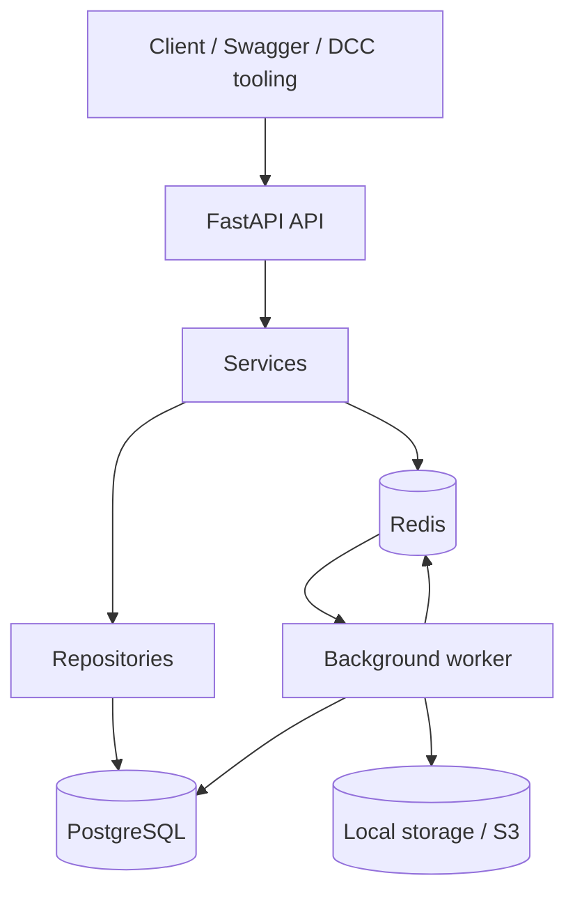

# Documentation Overview

This directory contains the public-facing reference material for Pipeline Production Hub.

## Start here

| Area | Why it matters | Start Here |
|------|----------------|------------|
| Architecture | Technical overview of the backend, data model, and infrastructure | [architecture/README.md](./architecture/README.md) |
| Guided walkthrough | Short recruiter-friendly demo flow using the seeded environment | [demo-script.md](./demo-script.md) |
| DCC integration | Artist-facing publish examples for Maya, Houdini, Nuke, and CLI tooling | [dcc-integration.md](./dcc-integration.md) |
| Testing and quality | How the project is validated locally and in CI | [testing-workflow.md](./testing-workflow.md) |
| Data model reference | Visual schema snapshot for the core production entities | [vfx_hub_schema.md](./vfx_hub_schema.md) |

## System Overview

## Notes

- `docs/architecture/` is the canonical technical reference.
- The other documents in this folder are portfolio-facing guides that explain demo flow, validation, and integration examples.
