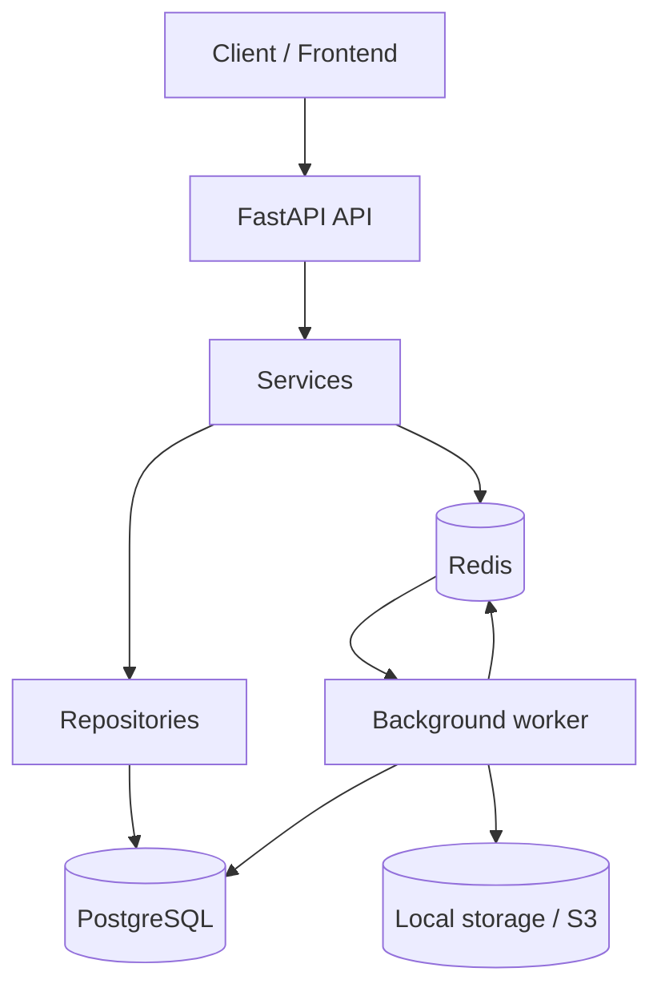

# Documentation Portal

This directory is the entrypoint for project documentation. Canonical technical docs live in English under `docs/architecture/`, while implementation planning material lives under `docs/plans/`.

## Documentation Map

| Area | Purpose | Start Here |
|------|---------|------------|
| Architecture | Canonical technical reference in reading order | [architecture/README.md](./architecture/README.md) |
| Plans | Feature plans, rollout notes, implementation sketches | [plans/README.md](./plans/README.md) |
| Testing workflow | Practical validation order for current backend work | [testing-workflow.md](./testing-workflow.md) |
| Writing conventions | Repository-level language guidance for AI-assisted work | [LEARN_ENGLISH.md](./LEARN_ENGLISH.md) |

## System Overview

## Rules

- `docs/architecture/` is the source of truth for technical documentation.
- Numbered files are reserved for architecture/reference docs only.
- `docs/plans/` is intentionally unnumbered and organized by feature slug.
- New docs should be written in English only.
- Mermaid diagrams are required for architecture docs and optional elsewhere when they improve clarity.

## Notes

- The old top-level localized docs are no longer the primary navigation layer.
- Existing plan content has been moved under `docs/plans/` and renamed with English slugs so future cleanup can happen in place.
