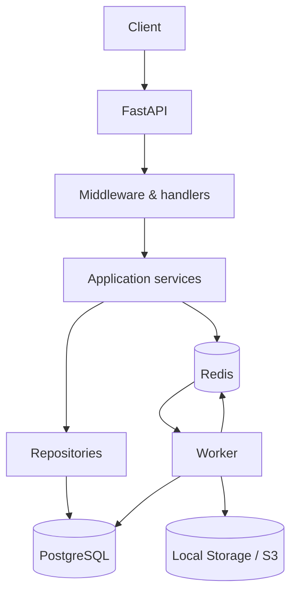
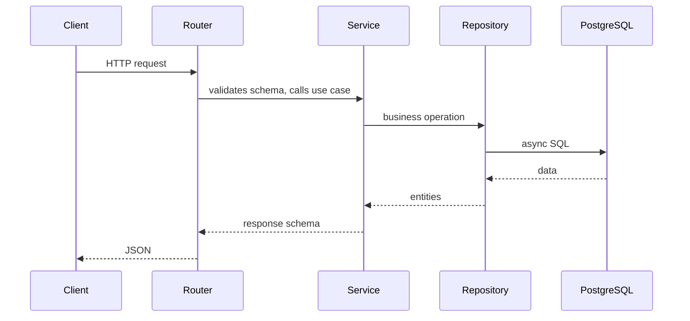
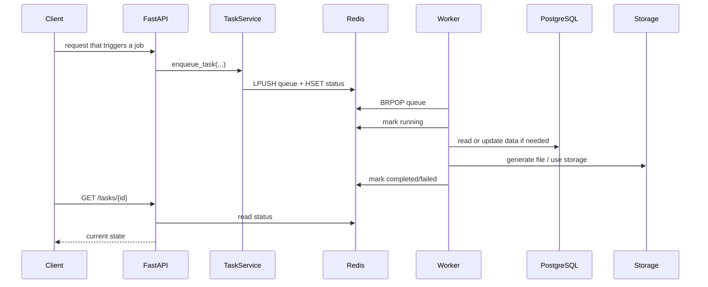

# System Overview

## What this repo is

Pipeline Production Hub is a FastAPI backend for VFX production management. It covers the full lifecycle of a project: shots, assets, department pipeline, reviews, client deliveries, hour tracking, and internal notifications.

The repo is divided into these layers:

- `api`: exposes HTTP endpoints.
- `services`: contains business logic.
- `repositories`: encapsulates PostgreSQL access.
- `db`: async SQLAlchemy engine and session.
- `models`: persistent entities.
- `schemas`: request/response contracts.
- `core`: config, security, exceptions, metrics, and shared utilities.
- `scripts/task_worker.py`: separate process for background jobs.

## Main components

## Implemented domains

| Domain               | Description                                                 |
| -------------------- | ----------------------------------------------------------- |
| Auth                 | JWT access/refresh, logout with blacklist, rate limit by IP |
| Projects             | Project CRUD with per-project roles                         |
| Episodes / Sequences | Editorial hierarchy for series                              |
| Shots / Assets       | Production entities with status and priorities              |
| Files                | Upload, download, versioning, checksum, deduplication       |
| Pipeline Tasks       | Department tasks per shot/asset with templates              |
| Notes                | Polymorphic feedback with threading on any entity           |
| Versions             | Artist reviewable deliveries (animation v003, comp v005)    |
| Shot-Asset Links     | Many-to-many shot ↔ asset relationship with link type       |
| Playlists            | Daily review sessions with items and review status          |
| Departments          | Dynamic department management and user assignment           |
| Notifications        | Internal notifications auto-generated from system events    |
| Tags                 | Flexible polymorphic categorization on any entity           |
| TimeLogs             | Hour tracking per task and artist, bid vs actual comparison |
| Deliveries           | Client delivery tracking with acceptance status             |
| Webhooks             | Signed outgoing events to external systems                  |
| Background Tasks     | Redis queue + worker for heavy tasks                        |

## Normal request flow

## Async task flow

## Docker Compose infrastructure

- `db`: PostgreSQL 16 Alpine.
- `redis`: Redis 7 Alpine.
- `api`: FastAPI with `uvicorn --reload`.
- `worker`: dedicated Python process for the queue.

## Current limits

- Persistent domain state lives in PostgreSQL.
- Redis does not replace the database; it stores transient state.
- S3 is implemented as an available storage backend alongside local storage.
- The task system uses Redis as a simple queue with per-task state.
