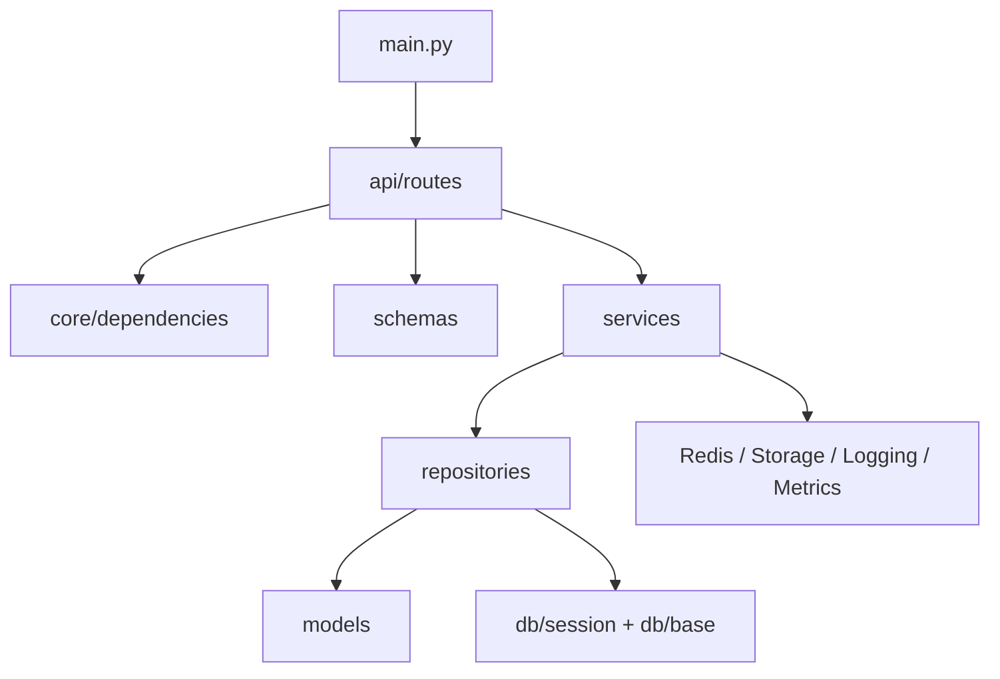

# Backend Layers

## Logical structure

## 1. Application entry point

`backend/app/main.py` builds the FastAPI app and mounts:

- CORS middleware (`CORSMiddleware`).
- request logging middleware (`RequestLoggingMiddleware`).
- global API rate limit middleware (`RateLimitMiddleware`).
- global exception handlers.
- Prometheus metrics configuration.
- routers per feature domain.

Infrastructure routes (`/health`, `/metrics`) are mounted directly on the app. All domain routes are grouped under an `APIRouter` with the `/api/v1` prefix and then mounted on the app.

### Middleware stack (outermost → innermost)

| Middleware | Purpose |
|------------|---------|
| `CORSMiddleware` | CORS headers, controlled by `CORS_ORIGINS` |
| `RequestLoggingMiddleware` | Request tracing, `X-Request-ID` |
| `RateLimitMiddleware` | Fixed-window rate limiting per user/IP |

### Mounted routers

Infrastructure (no version prefix):

| Prefix | Module | Domain |
|--------|--------|--------|
| `/health` | `health` | Health check |
| `/metrics` | `metrics` | Prometheus |

API v1 (`/api/v1` prefix):

| Prefix | Module | Domain |
|--------|--------|--------|
| `/auth` | `auth` | Authentication |
| `/projects` | `projects` | Projects CRUD |
| `/projects` | `shots.project_router` | Shots by project |
| `/projects` | `assets.project_router` | Assets by project |
| `/projects` | `files.project_router` | Files by project |
| `/projects` | `episodes.project_router` | Episodes by project |
| `/projects` | `sequences.project_router` | Sequences by project |
| `/projects` | `notes.projects_router` | Notes on project |
| `/projects` | `playlists.projects_router` | Playlists by project |
| `/projects` | `time_logs.projects_router` | TimeLogs by project |
| `/projects` | `deliveries.projects_router` | Deliveries by project |
| `/projects` | `webhooks.projects_router` | Webhooks by project |
| `/projects` | `versions.project_router` | Versions by project |
| `/projects` | `tags.projects_router` | Tags by project |
| `/episodes` | `episodes.router` | Episodes by id |
| `/sequences` | `sequences.router` | Sequences by id |
| `/sequences` | `tags.sequences_router` | Tags on a sequence |
| `/shots` | `shots.router` | Shots by id |
| `/shots` | `files.shots_router` | Files of a shot |
| `/shots` | `pipeline_tasks.shot_tasks_router` | Tasks of a shot |
| `/shots` | `notes.shots_router` | Notes on a shot |
| `/shots` | `versions.shots_router` | Versions of a shot |
| `/shots` | `shot_asset_links.shots_router` | Links of a shot |
| `/shots` | `tags.shots_router` | Tags on a shot |
| `/assets` | `assets.router` | Assets by id |
| `/assets` | `files.assets_router` | Files of an asset |
| `/assets` | `pipeline_tasks.asset_tasks_router` | Tasks of an asset |
| `/assets` | `notes.assets_router` | Notes on an asset |
| `/assets` | `versions.assets_router` | Versions of an asset |
| `/assets` | `shot_asset_links.assets_router` | Links of an asset |
| `/assets` | `tags.assets_router` | Tags on an asset |
| `/files` | `files.router` | Files by id |
| `/tasks` | `tasks.router` | Background tasks |
| `/webhooks` | `webhooks.router` | Webhooks CRUD |
| `/pipeline-templates` | `pipeline_tasks.template_router` | Pipeline templates |
| `/pipeline-tasks` | `pipeline_tasks.task_ops_router` | Task operations |
| `/pipeline-tasks` | `notes.pipeline_tasks_router` | Notes on a task |
| `/pipeline-tasks` | `time_logs.tasks_router` | TimeLogs of a task |
| `/pipeline-tasks` | `versions.pipeline_tasks_router` | Versions of a task |
| `/notes` | `notes.router` | Notes by id |
| `/versions` | `versions.router` | Versions by id |
| `/shot-asset-links` | `shot_asset_links.shot_asset_links_router` | Shot-asset links by id |
| `/playlists` | `playlists.router` | Playlists by id |
| `/playlist-items` | `playlists.playlist_items_router` | Playlist items |
| `/departments` | `departments.router` | Departments |
| `/department-members` | `departments.department_members_router` | Bulk department membership |
| `/users` | `users.router` | Users CRUD |
| `/users` | `departments.users_router` | Departments of a user |
| `/users` | `time_logs.users_router` | TimeLogs of a user |
| `/notifications` | `notifications.router` | Notifications |
| `/tags` | `tags.router` | Tags CRUD + search |
| `/entity-tags` | `tags.entity_tags_router` | Entity tags by id |
| `/timelogs` | `time_logs.router` | TimeLogs CRUD |
| `/deliveries` | `deliveries.router` | Deliveries by id |
| `/delivery-items` | `deliveries.delivery_items_router` | Delivery items |

## 2. Routers

Routers:

- receive HTTP requests.
- validate input via `schemas`.
- obtain dependencies like `AsyncSession` and `current_user`.
- delegate logic to the corresponding service.

## 3. Services

Services concentrate business rules.

Typical responsibilities:

- validate permissions.
- coordinate multiple repositories.
- decide whether something is sync or async.
- fire webhooks.
- interact with Redis or storage when applicable.

### Implemented services

| Service | Domain |
|---------|--------|
| `AuthService` | Login, refresh, logout |
| `UserService` | User CRUD and profile management |
| `ProjectService` | Projects + CSV export |
| `FileService` | Upload, download, versioning, storage |
| `TaskService` | Redis background tasks |
| `WebhookService` | Outgoing events |
| `PathTemplateService` | Storage paths per project type |
| `PipelineTaskService` | Pipeline tasks, templates, assignments |
| `ShotWorkflowService` | Shot status transitions and audit log |
| `AssetWorkflowService` | Asset status transitions and audit log |
| `NoteService` | Notes + polymorphic threading |
| `VersionService` | Artist reviewable versions |
| `ShotAssetLinkService` | Shot ↔ asset links |
| `PlaylistService` | Playlists and review sessions |
| `DepartmentService` | Departments and user assignment |
| `NotificationService` | Internal notifications |
| `TagService` | Tags and polymorphic attach/detach |
| `TimeLogService` | TimeLogs, bid vs actual summaries |
| `DeliveryService` | Deliveries, items, state machine |

## 4. Repositories

Repositories encapsulate queries and persistence against PostgreSQL.

Each repository has `__init__(self, db: AsyncSession)` and exposes async CRUD methods and domain-specific queries. No business logic lives here.

## 5. Shared core

`backend/app/core` contains shared infrastructure:

- `config.py`: settings via `pydantic-settings`.
- `security.py`: JWT and bcrypt hashing.
- `dependencies.py`: auth and RBAC as FastAPI dependencies.
- `exceptions.py`: HTTP-friendly business errors (`NotFoundError`, `ForbiddenError`, `ConflictError`, `UnprocessableError`).
- `logging.py`: structured logging.
- `metrics.py`: Prometheus instrumentation.
- `token_blacklist.py`: refresh token revocation in Redis.
- `login_rate_limit.py`: login rate limiting per IP in Redis.
- `active_users.py`: active user tracking in Redis.

## 6. Database session

`db/session.py` creates:

- async `engine`.
- `AsyncSessionLocal`.
- `get_db()` as a FastAPI dependency.

The dependency:

- `yield session`
- `commit` at the end if no error
- `rollback` on exception

Each request runs inside a transactional session.

## 7. Design decisions

- `main.py` stays thin — only wiring.
- Most behavior lives in services.
- PostgreSQL is the source of truth.
- Redis is used for ephemeral state and operational decoupling.
- The worker offloads slow or non-critical operations from the request path.
- `AppError` subclasses decouple business errors from HTTP protocol.
