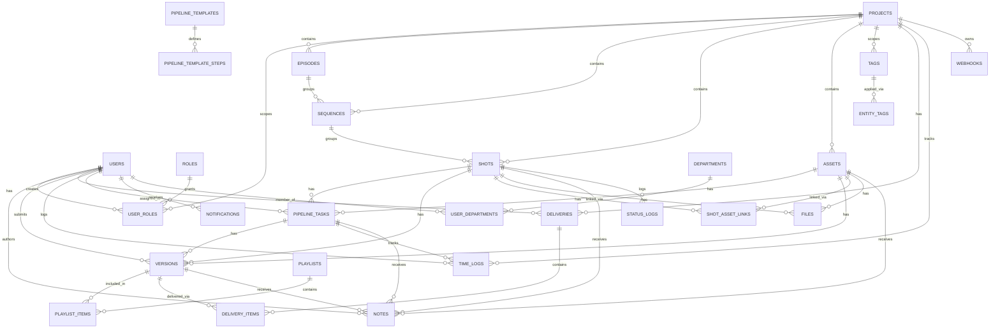

# PostgreSQL Architecture

## Role of PostgreSQL

PostgreSQL is the primary database. It stores all persistent domain state:

- user identity and permissions
- production hierarchy (projects, episodes, sequences, shots, assets)
- files and storage metadata
- department pipeline (templates and tasks)
- feedback and reviews (notes, versions, playlists)
- entity relationships (shot-asset links, tags)
- hour tracking (timelogs)
- client deliveries
- internal notifications and external webhooks

## Session and engine

Async connection is created in `backend/app/db/session.py`.

Key points:

- normalizes `postgres://` and `postgresql://` to `postgresql+asyncpg://`.
- uses `create_async_engine(..., pool_pre_ping=True)`.
- exposes `AsyncSessionLocal`.
- `get_db()` does `commit/rollback` per request.

## Entity map

This diagram is intentionally compact. It shows the main aggregates and bridge tables; detailed ownership and per-entity behavior are documented in the sections below.

## Domain by area

### Identity and permissions

| Table | Description |
|-------|-------------|
| `users` | Primary identity |
| `roles` | Role catalog: `admin`, `supervisor`, `lead`, `artist`, `worker`, `client` |
| `user_roles` | Role assignment — global (`project_id = NULL`) or per-project |

RBAC rule: `project_id = NULL` means the role applies globally.

### Production hierarchy

| Table | Description |
|-------|-------------|
| `projects` | Domain root with `code`, `type`, `status`, `client` |
| `episodes` | Optional for serialized projects |
| `sequences` | Group shots, belong to project and optionally an episode |
| `shots` | Fundamental work unit with `frame_in/out`, `bid_days`, `priority` |
| `assets` | Reusable elements (character, prop, environment, etc.) |

### Files

| Table | Description |
|-------|-------------|
| `files` | File metadata: `storage_path`, `version`, `checksum_sha256`, `size_bytes`, soft delete via `deleted_at` |

A file belongs to exactly one `shot` or one `asset` (check constraint).

### Pipeline

| Table | Description |
|-------|-------------|
| `pipeline_templates` | Pipeline templates by entity type |
| `pipeline_template_steps` | Steps of a template (animation, lighting, comp…) |
| `pipeline_tasks` | Task instances on a shot or asset, with status and assignee |

### Feedback and reviews

| Table | Description |
|-------|-------------|
| `notes` | Polymorphic feedback on shot, asset, version, pipeline_task, project |
| `versions` | Reviewable deliveries (animation v003, comp v005) with review status |
| `playlists` | Daily review sessions with session status |
| `playlist_items` | Versions included in a playlist, with review outcome |

### Entity relationships

| Table | Description |
|-------|-------------|
| `shot_asset_links` | Many-to-many shot ↔ asset with type (`uses`, `references`, `instance_of`) |
| `tags` | Tags scoped to a project or global (`project_id = NULL`) |
| `entity_tags` | Polymorphic association tag → entity (shot, asset, sequence, version…) |

### Operational tracking

| Table | Description |
|-------|-------------|
| `time_logs` | Hours logged per artist per task, with `duration_minutes` and `date` |
| `departments` | Dynamic studio departments |
| `user_departments` | Artist ↔ department assignment |

### Deliveries and communication

| Table | Description |
|-------|-------------|
| `deliveries` | Client deliveries with status (`preparing → sent → acknowledged → accepted/rejected`) |
| `delivery_items` | Versions included in a delivery, with denormalized `shot_id` |
| `notifications` | Internal per-user notifications for system events |
| `webhooks` | External endpoint configuration for outgoing events |
| `status_logs` | Audit trail of entity status changes |

## Key constraints

| Constraint | Rule |
|-----------|------|
| `projects.code` | Globally unique |
| `episodes.code` | Unique per project |
| `sequences.code` | Unique per project |
| `shots.code` | Unique per project |
| `assets.name` | Unique per project |
| `files` | Exactly one parent: `shot_id` or `asset_id` |
| `shots` | `frame_end >= frame_start` when both are set |
| `shot_asset_links` | Unique per `(shot_id, asset_id)` |
| `tags` | Unique per `(project_id, name)` |
| `entity_tags` | Unique per `(tag_id, entity_type, entity_id)` |
| `time_logs` | `duration_minutes` between 1 and 1440 |
| `delivery_items` | Unique per `(delivery_id, version_id)` |

## What goes to PostgreSQL vs Redis

**PostgreSQL** — durable business state:

- entity state and relationships
- file metadata
- webhook configuration
- change history
- logged hours
- deliveries and notifications

**Redis** — ephemeral or operational state:

- task queue
- refresh token blacklist
- login rate limit
- active user presence
