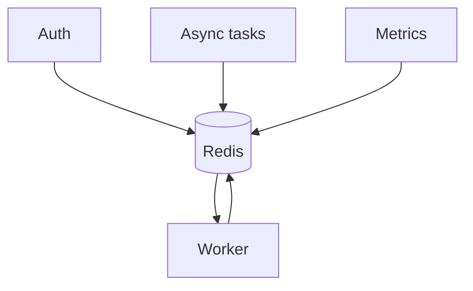
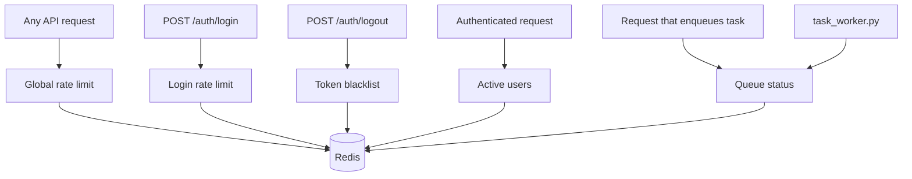

# Redis Architecture

## Role of Redis

Redis is used for transient state and low-latency operations. It is not the source of truth for business data.

Current uses:

- async job queue.
- background task status.
- refresh token blacklist.
- login rate limiting.
- global API rate limiting.
- active user tracking for metrics.

## Overview

## 1. Task queue

`TaskQueueRepository` uses Redis like this:

- `LPUSH` to the queue configured in `task_queue_name`.
- `BRPOP` from the worker for blocking consumption.
- `HSET` to persist status per `task_id`.
- `EXPIRE` to clean up stale states.

Key patterns:

- queue: `tasks:queue:default` by default.
- state: `tasks:status:{task_id}`.

## 2. Refresh token blacklist

`core/token_blacklist.py` uses Redis to invalidate refresh tokens on logout.

Pattern:

- key: `auth:blacklist:{token}`
- value: `"1"`
- TTL: remaining time until JWT `exp`

This avoids persisting revoked tokens in PostgreSQL.

## 3. Login rate limit

`core/login_rate_limit.py` controls failed attempts by IP.

Pattern:

- key: `auth:login_rate:{client_ip}`
- value: integer counter
- TTL: `login_rate_limit_window_min`

Flow:

- before authenticating, check if the IP is blocked.
- on failed login, increment.
- on successful login, clear the counter.

## 4. Global API rate limiting

`core/rate_limit.py` is used by `RateLimitMiddleware` to apply a fixed-window rate limiter to all non-exempt routes.

Identity is resolved per request:

- if a valid Bearer token is present: `user:{sub}`.
- otherwise: `ip:{client_host}`.

Pattern:

- key: `api:rate:{identity}`
- value: integer counter (INCR on every request)
- TTL: `rate_limit_window_seconds` (set only on the first hit per window)

Response headers added on every request:

| Header | Description |
|--------|-------------|
| `X-RateLimit-Limit` | Max requests in the window |
| `X-RateLimit-Remaining` | Remaining requests |
| `X-RateLimit-Reset` | Seconds until the window resets |
| `Retry-After` | Only added when the request is rejected (429) |

Exempt paths (no rate limiting applied): `/health`, `/metrics`, `/docs`, `/redoc`, `/openapi.json`.

If Redis is unavailable the middleware fails open — the request proceeds normally.

## 5. Active users

`core/active_users.py` uses a sorted set for recent activity metrics.

Pattern:

- key: `metrics:active_users:last_seen`
- member: `user_id`
- score: Unix timestamp

Every authenticated request calls `mark_user_active(user_id)` which:

- updates the last seen timestamp.
- removes members outside the time window.
- updates the Prometheus active users gauge.

## 6. Redis flow diagram

## Why this approach

- separates ephemeral state from persistent domain.
- decouples heavy tasks from request-response.
- reduces cost of frequent operational queries.
- TTL prevents accumulation of stale data.

## Current limitations

The queue system is simple and effective for this backend, but does not yet have:

- sophisticated persistent retries
- dead-letter queue
- complex scheduling
- distributed orchestration

Today it is a lightweight Redis queue with per-task state.
