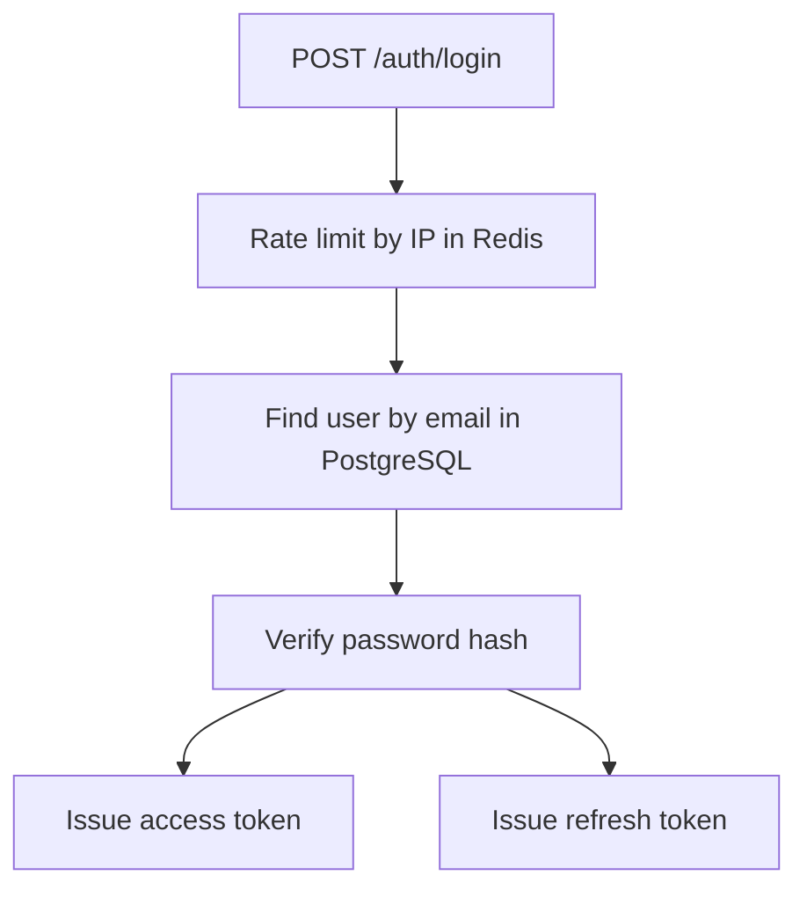
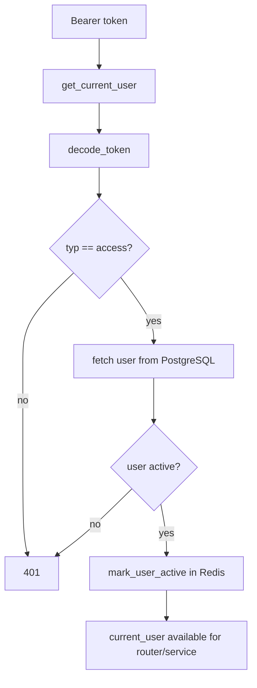
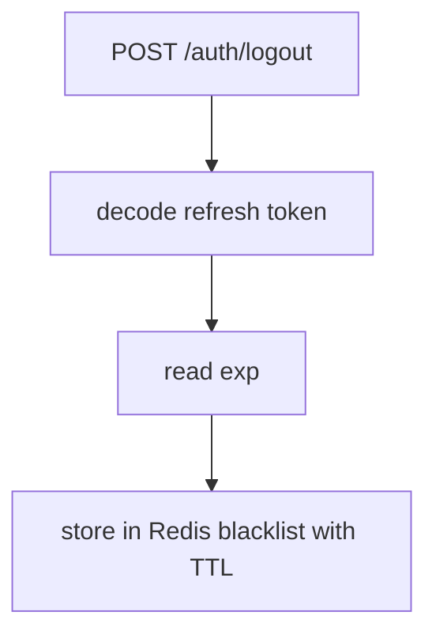
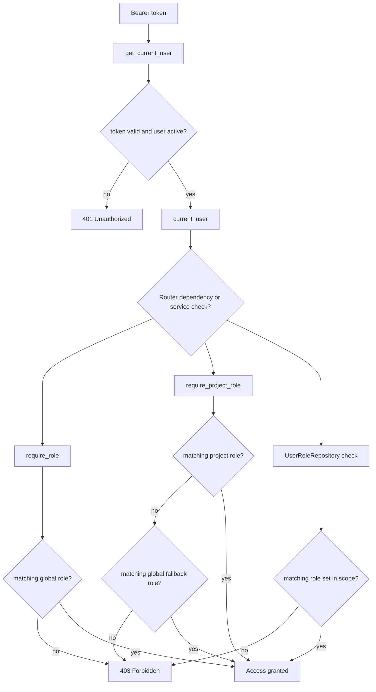

# Auth and RBAC

## Summary

Authentication uses JWT and authorization mixes global roles with per-project roles.

Main components:

- `AuthService`
- `core/security.py`
- `core/dependencies.py`
- `core/token_blacklist.py`
- `core/login_rate_limit.py`
- tables: `users`, `roles`, `user_roles`

## Authentication flow

## Protected request flow

## Token types

- `access`: short-lived, for authenticated requests.
- `refresh`: used to issue a new access token.

Validations enforced in code:

- correct `typ` claim.
- valid `sub` convertible to UUID.
- user exists and is active.

## Logout and revocation

Logout does not invalidate already-issued access tokens. It revokes the refresh token by storing it in Redis until its expiration.

## Refresh

`POST /auth/refresh`:

- rejects the token if it is blacklisted.
- validates `typ == refresh`.
- validates the user.
- issues a new access token.

## Authorization model

Authorization is centered on the `user_roles` table.

Two scopes:

- global: `project_id = NULL`
- project: `project_id = <uuid>`

Main dependency helpers:

- `require_role(role)` — global role guard.
- `require_project_role(project_param_name, role)` — project-scoped guard with global fallback.
- direct checks in services via `UserRoleRepository`.

## RBAC implementation flow

Protected requests always pass through authentication first. If the token is wrong, expired, malformed, or the user is inactive, the request fails as `401 Unauthorized`. Role failures happen only after a valid `current_user` exists, and those failures are returned as `403 Forbidden`.

## Role storage and scope

RBAC data is split into:

- `roles`: the role catalog (`admin`, `supervisor`, `lead`, `artist`, `worker`, `client`)
- `user_roles`: the assignment table that binds a user to a role in a specific scope

Scope is encoded directly in `user_roles.project_id`:

- `NULL` means the role is global
- a project UUID means the role applies only inside that project

This is the core rule used everywhere in the repo. There is no separate "global roles" table and no separate permission matrix table in the database.

## Authorization layers

### 1. Authentication gate

`get_current_user()` in `core/dependencies.py`:

- reads the Bearer token using `HTTPBearer`
- decodes the JWT
- requires `typ == "access"`
- parses `sub` as a user UUID
- fetches the user from PostgreSQL
- rejects missing or inactive users
- marks the user as active in Redis

This function is the standard entrypoint for protected routes.

### 2. Router-level guards

The repo uses FastAPI dependencies for simple access gates:

- `require_role("admin")` checks only global assignments
- `require_project_role("project_id", "lead")` checks the path param project scope first, then the same role globally

Typical usage:

- user administration routes use `require_role(...)`
- project/entity routes can use `require_project_role(...)` when access is tied to a project path parameter

### 3. Service-level checks

More detailed authorization logic happens inside services via `UserRoleRepository`.

Main methods:

- `has_global_any_role(user_id, role_names)` — global roles only
- `has_any_role(user_id, role_names, project_id)` — project role or global fallback

This layer is used when access depends on:

- multiple allowed roles
- different rules for read vs write operations
- behavior that is too specific to keep only in router dependencies

## Global fallback behavior

The repo consistently supports global fallback for project-scoped authorization.

Meaning:

- if a check asks for role `lead` in project `P1`
- first the code looks for `lead` on `P1`
- if that does not exist, it looks for global `lead`

This behavior exists in both:

- `require_project_role(...)`
- `UserRoleRepository.has_any_role(...)`

It does **not** mean that global `admin` automatically satisfies every arbitrary role check through those helpers. The fallback is for the same required role unless the surrounding service explicitly checks broader role sets.

## Example: project access

Project access is a good example because it uses multiple RBAC patterns in the same service.

In `ProjectService`:

- `create_project(...)` requires global `admin` or `supervisor`
- `get_project(...)` allows any of `admin`, `supervisor`, `lead`, `artist`, `worker` in project scope or globally
- `patch_project(...)`, `archive_project(...)`, and `restore_project(...)` require project management access
- `delete_project(...)` requires global `admin` and also `force=true`

Project management is implemented as:

1. allow global `admin` or `supervisor`
2. otherwise allow project-scoped `lead`
3. otherwise raise `ForbiddenError`

So the service layer combines simple role membership with business-specific rules.

## Router vs service checks

Use router dependencies when:

- one role is enough
- the rule is obvious and static
- the route boundary is the right place to reject access early

Use service checks when:

- multiple roles are allowed
- project and global scopes must be combined
- the rule depends on the operation itself
- different endpoints share the same business authorization behavior

This repo uses both patterns together. Router dependencies handle coarse entry checks, and services handle richer business permissions.

## How to debug RBAC

When a request is unexpectedly blocked:

1. check whether it is a `401` or `403`
2. if `401`, inspect token type, subject, user existence, and active status
3. if `403`, inspect `user_roles` for the user
4. confirm whether the code expects:
   - global only
   - project only
   - project with global fallback
5. confirm the route or service is checking the role you think it is checking

Useful places to inspect:

- `core/dependencies.py`
- `repositories/user_role_repository.py`
- the service used by the endpoint
- `test/test_rbac.py`

## Roles

| Role         | Typical scope                                     |
| ------------ | ------------------------------------------------- |
| `admin`      | Full global access                                |
| `supervisor` | Global or project-level oversight                 |
| `lead`       | Modification within a project                     |
| `artist`     | Operational work, mostly writes on assigned tasks |
| `worker`     | Read-oriented or background operations            |
| `client`     | Restricted review and client-facing visibility    |

## Permission examples

| Action         | Required role                                 |
| -------------- | --------------------------------------------- |
| Create project | Global `admin` or `supervisor`                |
| Edit project   | Global `admin/supervisor` or project `lead`   |
| Upload file    | `admin/supervisor/lead/artist` on the project |
| Delete file    | `admin/supervisor/lead` on the project        |

## Permission matrix from code

There is no single centralized permission registry in this repo. The effective permissions are defined where each action is protected: sometimes in router dependencies, sometimes in service methods.

Use this table as a practical map of the current implementation.

| Area           | Action                             | Allowed role(s)                                   | Scope rule                                  | Enforced in                                            |
| -------------- | ---------------------------------- | ------------------------------------------------- | ------------------------------------------- | ------------------------------------------------------ |
| Users          | List users                         | `supervisor`                                      | Global only                                 | `api/routes/users.py` via `require_role("supervisor")` |
| Users          | Create user                        | `admin`                                           | Global only                                 | `api/routes/users.py` via `require_role("admin")`      |
| Users          | Update own profile                 | Any authenticated user                            | Self only                                   | `services/user_service.py`                             |
| Users          | Update another user                | `admin`                                           | Global only                                 | `services/user_service.py`                             |
| Users          | Deactivate user                    | `admin`                                           | Global only                                 | `api/routes/users.py` via `require_role("admin")`      |
| Users          | Assign/remove role                 | `admin`                                           | Global only                                 | `api/routes/users.py` via `require_role("admin")`      |
| Projects       | Create project                     | `admin`, `supervisor`                             | Global only                                 | `services/project_service.py`                          |
| Projects       | List projects                      | `admin`, `supervisor`, `lead`, `artist`, `worker` | Global only in current implementation       | `services/project_service.py`                          |
| Projects       | Get project                        | `admin`, `supervisor`, `lead`, `artist`, `worker` | Project role or global fallback             | `services/project_service.py`                          |
| Projects       | Patch/archive/restore project      | `admin`, `supervisor`, `lead`                     | Global `admin/supervisor` or project `lead` | `services/project_service.py`                          |
| Projects       | Delete project                     | `admin`                                           | Global only                                 | `services/project_service.py`                          |
| Files          | Upload file                        | `admin`, `supervisor`, `lead`, `artist`           | Project role or global fallback             | `services/file_service.py`                             |
| Files          | Read/download/list versions        | `admin`, `supervisor`, `lead`, `artist`, `worker` | Project role or global fallback             | `services/file_service.py`                             |
| Files          | Update metadata / delete / restore | `admin`, `supervisor`, `lead`                     | Project role or global fallback             | `services/file_service.py`                             |
| Files          | Hard delete file                   | `admin`                                           | Global only                                 | `services/file_service.py`                             |
| Webhooks       | List/get/create/update/test        | `admin`, `supervisor`                             | Global only                                 | `services/webhook_service.py`                          |
| Webhooks       | Delete webhook                     | `admin`                                           | Global only                                 | `services/webhook_service.py`                          |
| Shot workflow  | Artist actions                     | `artist`                                          | Project role or global fallback             | `services/shot_workflow_service.py`                    |
| Shot workflow  | Lead approvals/changes             | `lead`                                            | Project role or global fallback             | `services/shot_workflow_service.py`                    |
| Shot workflow  | Supervisor/admin actions           | `supervisor`, `admin`                             | Project role or global fallback             | `services/shot_workflow_service.py`                    |
| Asset workflow | Artist actions                     | `artist`                                          | Project role or global fallback             | `services/asset_workflow_service.py`                   |
| Asset workflow | Lead approvals/changes             | `lead`                                            | Project role or global fallback             | `services/asset_workflow_service.py`                   |
| Asset workflow | Supervisor/admin actions           | `supervisor`, `admin`                             | Project role or global fallback             | `services/asset_workflow_service.py`                   |

The matrix above is intentionally practical, not exhaustive. When in doubt, the source of truth is the route dependency or service method protecting the action.

## Where each role gets its permissions

The repo assigns permissions in three places:

1. `models/role.py`
   - defines which roles exist
   - does **not** define what each role can do
2. `models/user_role.py`
   - assigns a role to a user
   - stores whether that role is global or project-scoped
3. routes and services
   - define what a role is allowed to do for a specific action
   - this is where the real permission rules live

So if you ask "where do I assign what a role can do?", the answer is: in the authorization checks attached to each endpoint or business operation, not in the role model itself.

## Test coverage

RBAC behavior is covered in `test/test_rbac.py`, including:

- global role success and failure
- project-scoped success and failure
- global fallback for project checks
- different project roles for the same user
- invalid or missing project path parameter behavior

## Auth and Redis

Redis appears in auth for:

- login rate limiting.
- refresh token blacklist.
- active user metrics.

User identity and roles always come from PostgreSQL.
