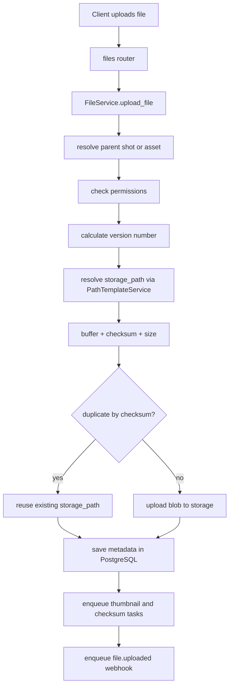

# Files and Storage

## What this layer handles

The file layer manages:

- upload
- download
- persisted metadata
- versioning
- checksum
- deduplication by hash
- path templates per project type
- async task dispatch post-upload

## Components

- `FileService`
- `FileRepository`
- `PathTemplateService`
- `services/storage/local.py`
- `services/storage/s3.py`
- `services/storage/factory.py`

## Upload flow

## Where each piece is stored

**PostgreSQL:**

- file metadata
- version number
- hash
- size
- relationship to shot or asset
- uploader user
- soft delete

**Storage backend:**

- actual binary content

**Redis:**

- state of tasks triggered by the upload

## Versioning

The version number is calculated per logical combination:

- `shot_id + original_name`
- or `asset_id + original_name`

This allows maintaining version history of the same logical file.

## Integrity and deduplication

During upload:

- `checksum_sha256` is calculated.
- `size_bytes` is measured.
- rejected if it exceeds `storage_max_upload_size_bytes`.
- if a blob with the same checksum already exists in storage, the existing `storage_path` is reused.

## Download

Current behavior:

- if the backend is `local`, opens a stream and re-verifies the checksum before responding.
- if the backend is not local, returns a signed URL or backend URL.

## Storage backends

### Local

`LocalStorage` works today.

Characteristics:

- stores inside `local_storage_root`.
- validates that the path does not escape the root.
- returns `local://...` URLs as logical references.

### S3

`S3Storage` exists as a prepared interface, but is currently partial.

Real state:

- `get_url()` returns a logical URL.
- `upload()`, `download()`, `delete()` and `exists()` raise `NotImplementedError`.

## Path templates

`PathTemplateService` builds paths based on `project_type`.

Supported templates for:

- `film`
- `series`
- `commercial`
- `game`
- `other`
- basic default if no type set

Conceptual examples:

- series project: `/projects/{project}/episodes/{episode}/shots/{sequence}/{shot}/publish/...`
- asset: `/projects/{project}/assets/{asset_type}/{asset_code}/work/...`

## Key design observation

The model cleanly separates metadata from the blob. This allows swapping storage backends without redesigning the domain layer.
