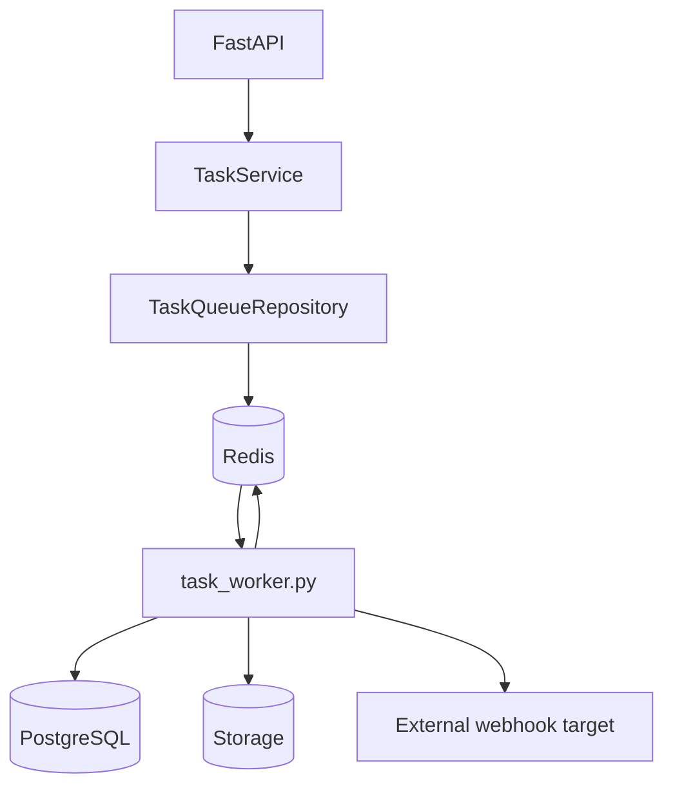
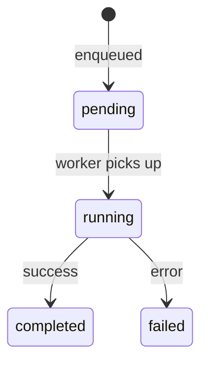
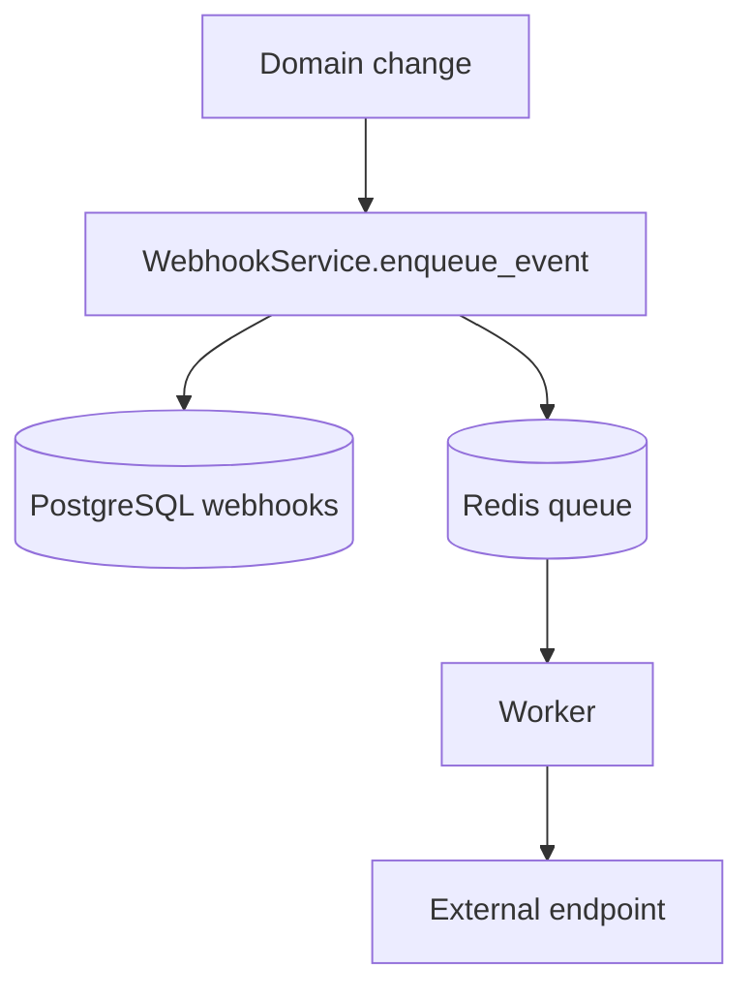

# Background Jobs and Webhooks

## Summary

This repo has a dedicated worker that consumes tasks from Redis. This is used to offload heavy or secondary operations from the synchronous request path.

## Components

- `TaskService`
- `TaskQueueRepository`
- `backend/app/scripts/task_worker.py`
- `WebhookService`

## Task types

| Type | Description |
|------|-------------|
| `thumbnail` | Generate thumbnail for an uploaded file |
| `checksum_large_file` | Compute checksum for large files async |
| `webhook_dispatch` | Deliver a webhook event to an external endpoint |
| `project_export_csv` | Export project shots and assets as CSV |

## Worker architecture

## Task lifecycle

State is stored in Redis with timestamps and result or error payload.

## Project CSV export

The project export has two modes:

- **synchronous** if total shots + assets is below the threshold.
- **asynchronous** if it exceeds `project_export_async_threshold_entities`.

Async flow:

1. API enqueues `project_export_csv`.
2. Worker reads project, shots, and assets from PostgreSQL.
3. Generates CSV.
4. Uploads it to the storage backend.
5. Stores the `download_url` in Redis.

## Webhooks

Configured webhooks are stored in PostgreSQL, but delivery happens via the queue.

## Webhook signing

Each webhook has a `secret` and the payload is signed with HMAC SHA-256.

Headers sent by the worker:

- `Content-Type: application/json`
- `X-Webhook-Event`
- `X-Webhook-Signature`

## Delivery retries

Current dispatch does simple retries with delays:

- 1 second
- 5 seconds
- 25 seconds

If all fail, the task ends in `failed`.

## Events that trigger webhooks

| Event | Trigger |
|-------|---------|
| `file.uploaded` | File successfully uploaded |
| `assignment.changed` | Task assignment changed |
| `status.changed` | Entity status changed (model exists, dispatch varies) |

## Design observation

Storing configuration in PostgreSQL and delivery in Redis/worker is a clean separation:

- PostgreSQL preserves configuration and ownership.
- Redis coordinates transient execution.
- The worker handles side effects outside the system.
