# VFX Production Features

Documentation of the production-specific domains implemented on top of the projects/shots/assets foundation.

---

## 1. Pipeline Tasks

Pipeline tasks are the departmental unit of work. Each shot or asset passes through multiple steps (animation → lighting → compositing), each with its own status and assignee.

### Entities

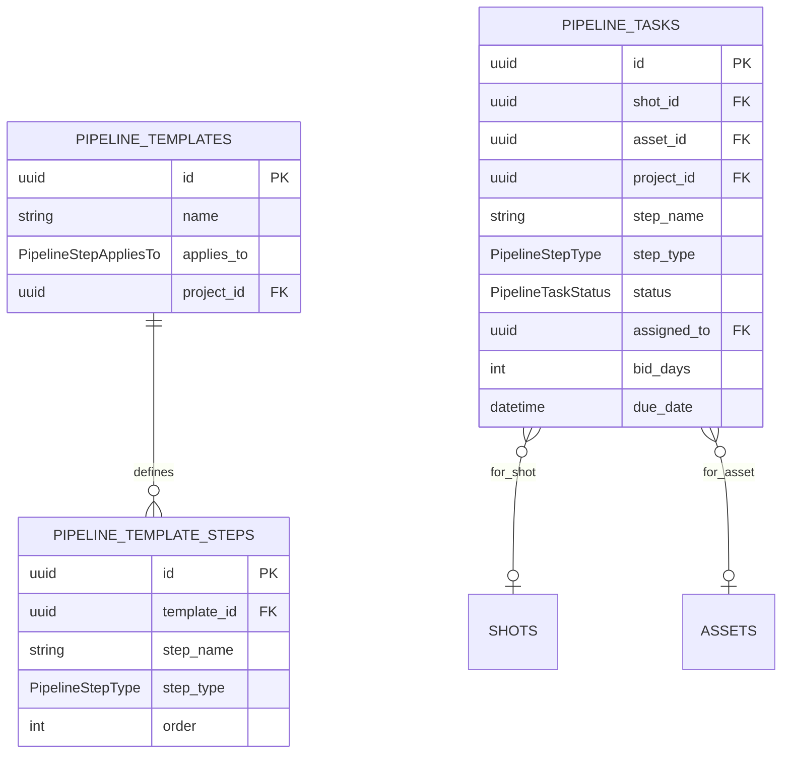

### Key endpoints

```
GET/POST  /pipeline-templates
GET/POST  /shots/{id}/pipeline-tasks
GET/POST  /assets/{id}/pipeline-tasks
PATCH     /pipeline-tasks/{id}
PATCH     /pipeline-tasks/{id}/status
PATCH     /pipeline-tasks/{id}/assign
```

---

## 2. Notes / Feedback

The polymorphic feedback system allows leaving comments on any entity: shots, assets, versions, pipeline tasks, and projects. Supports threading via `parent_id`.

### Entity

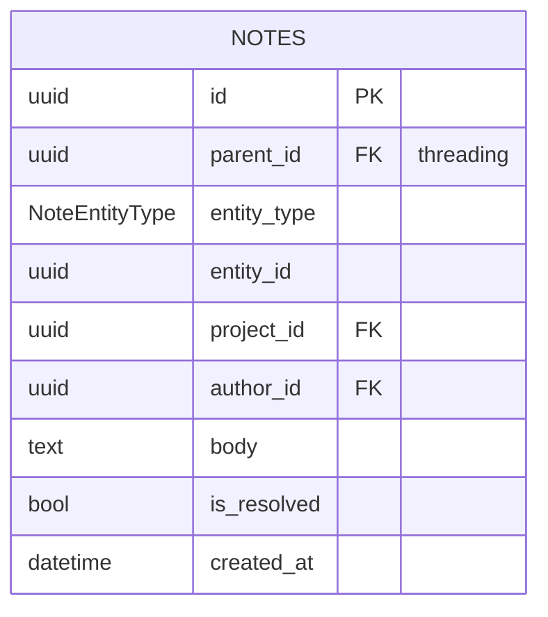

### Feedback flow in dailies

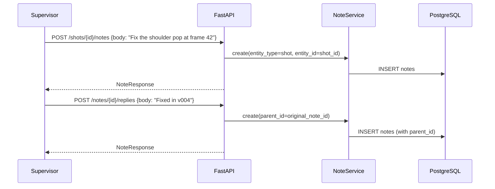

### Key endpoints

```
POST   /shots/{id}/notes
POST   /assets/{id}/notes
POST   /pipeline-tasks/{id}/notes
POST   /projects/{id}/notes
POST   /notes/{id}/replies
GET    /notes/{id}
PATCH  /notes/{id}
PATCH  /notes/{id}/resolve
DELETE /notes/{id}
```

---

## 3. Versions / Publishes

A Version is an artist's reviewable delivery: "animation v003 of shot SH010". It groups the delivery metadata (review status, who submitted it, thumbnail) and is what gets presented in dailies.

### Review state machine

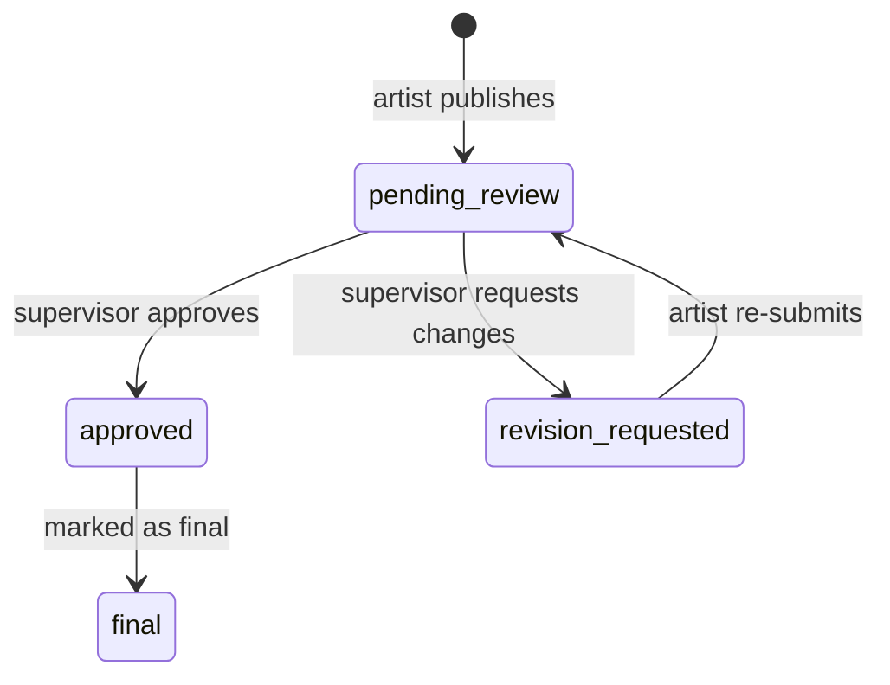

### Entity

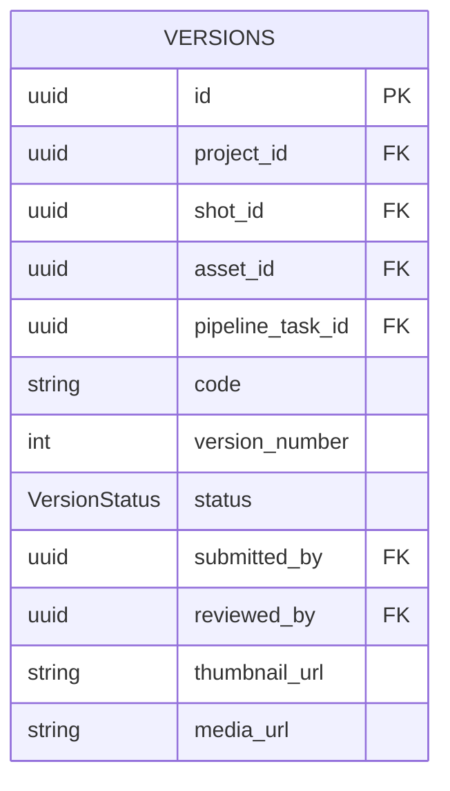

### Key endpoints

```
POST  /shots/{id}/versions
POST  /assets/{id}/versions
GET   /versions/{id}
PATCH /versions/{id}/status
GET   /pipeline-tasks/{id}/versions
```

---

## 4. Shot-Asset Links

Answers two key production questions: "What assets does shot SH010 use?" and "If I change this asset, which shots are affected?"

### Link types

| Type | Description |
|------|-------------|
| `uses` | Shot directly uses the asset |
| `references` | Shot references the asset (not a direct instance) |
| `instance_of` | Shot has a specific instance of the asset |

### Entity

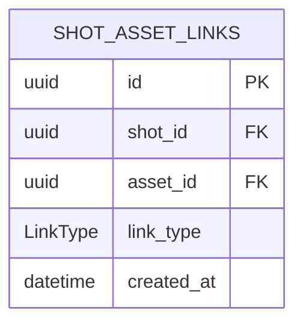

### Key endpoints

```
POST   /shots/{id}/assets           link asset to shot
DELETE /shots/{id}/assets/{asset_id}
GET    /shots/{id}/assets            assets used by the shot
GET    /assets/{id}/shots            shots that use the asset
```

---

## 5. Playlists / Review Sessions

Playlists organize versions for a dailies session. The supervisor can mark the review outcome per item.

### Session state machine

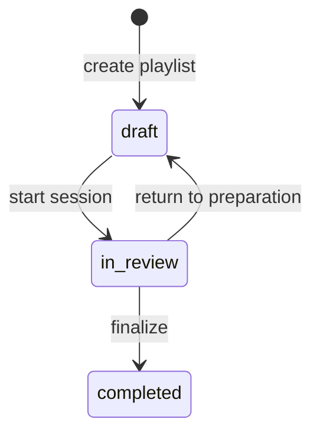

### Entities

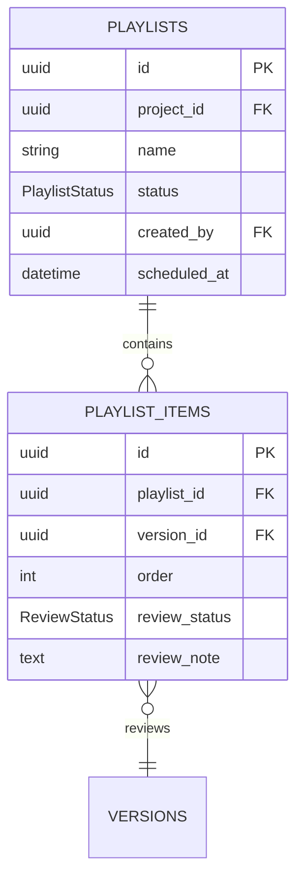

### Key endpoints

```
POST  /projects/{id}/playlists
GET   /playlists/{id}
POST  /playlists/{id}/items
PATCH /playlists/{id}/items/{item_id}/review
PATCH /playlists/{id}/status
```

---

## 6. Departments

Dynamic management of studio departments. Artists can belong to multiple departments.

### Entities

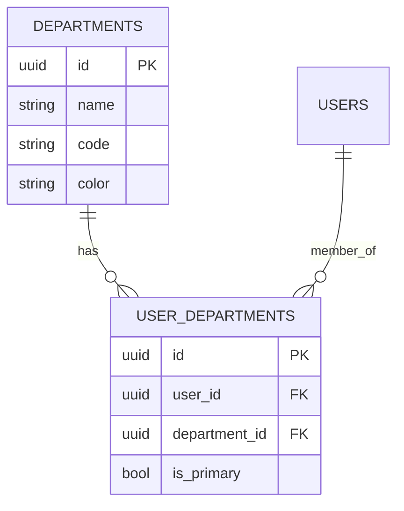

### Key endpoints

```
POST   /departments
GET    /departments
PATCH  /departments/{id}
POST   /users/{id}/departments      assign user to department
DELETE /users/{id}/departments/{dept_id}
GET    /users/{id}/departments
```

---

## 7. Notifications

Internal notifications are auto-generated by system events: task assignments, received notes, approved versions.

### Event types

| Event | Description |
|-------|-------------|
| `task_assigned` | A pipeline task was assigned to the user |
| `task_status_changed` | Status changed on an assigned task |
| `note_created` | Someone left a note on the user's entity |
| `note_reply` | Someone replied to the user's note |
| `version_submitted` | An artist submitted a version for review |
| `version_reviewed` | The supervisor reviewed the artist's version |
| `mention` | The user was mentioned in a note |

### Flow

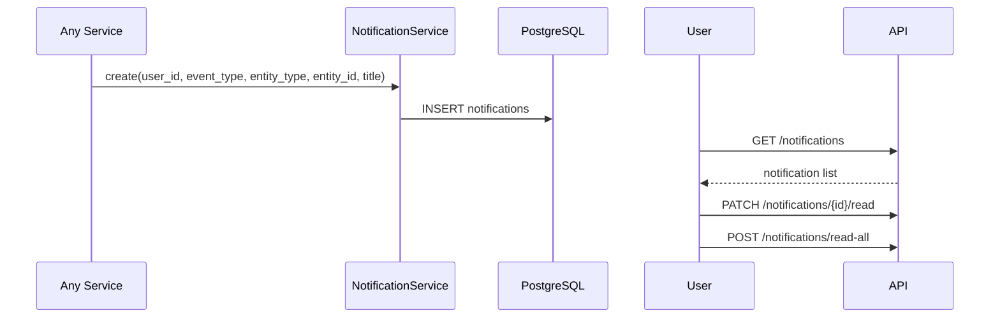

### Key endpoints

```
GET    /notifications
GET    /notifications/unread-count
PATCH  /notifications/{id}/read
POST   /notifications/read-all
DELETE /notifications/{id}
```

---

## 8. Tags

Polymorphic categorization system. Tags can be global (no `project_id`) or project-scoped.

### Entities

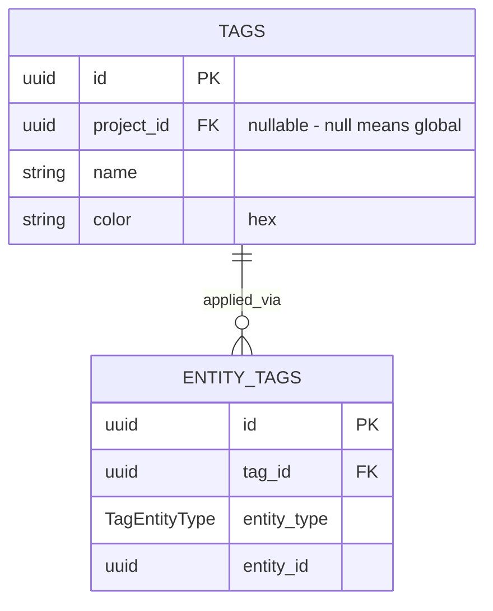

### Supported entity types

`project`, `episode`, `sequence`, `shot`, `asset`, `pipeline_task`, `version`

### Tagging flow

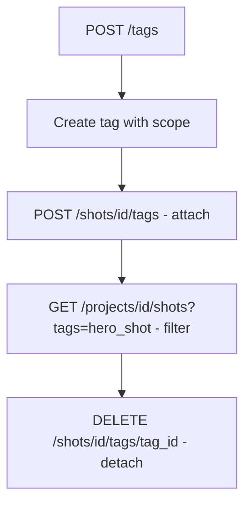

### Key endpoints

```
POST   /tags
GET    /tags?project_id=
GET    /tags/search?q=hero
PATCH  /tags/{id}
DELETE /tags/{id}

POST   /shots/{id}/tags
DELETE /shots/{id}/tags/{tag_id}
GET    /shots/{id}/tags

POST   /assets/{id}/tags
POST   /sequences/{id}/tags
```

---

## 9. TimeLogs

Hour tracking per artist and task. Allows comparing budgeted hours (`bid_days` on the shot) against actual hours worked.

### Validation rules

- `duration_minutes`: minimum 1, maximum 1440 (24h).
- `date`: cannot be in the future.
- Only the owner or admin can edit/delete a timelog.

### Entity

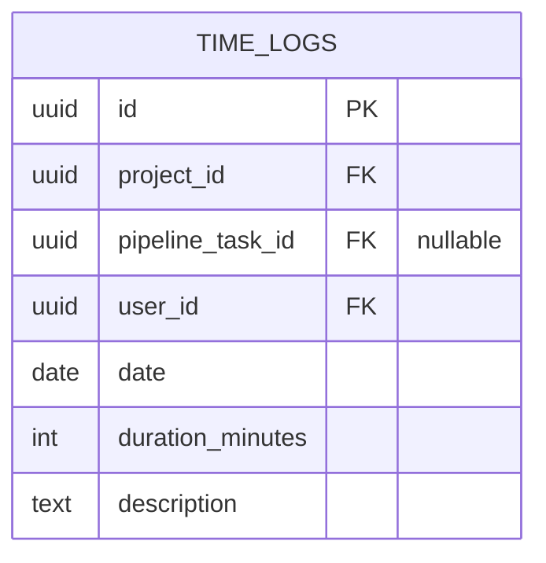

### Bid vs Actual

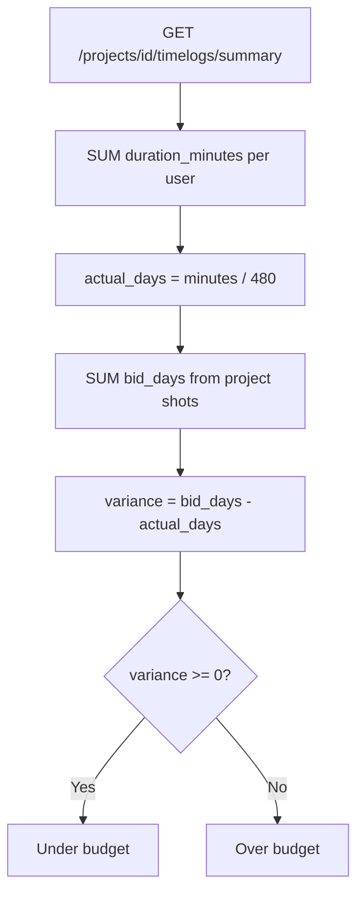

### Key endpoints

```
POST   /timelogs
GET    /timelogs/{id}
PATCH  /timelogs/{id}
DELETE /timelogs/{id}

GET    /projects/{id}/timelogs
GET    /projects/{id}/timelogs/summary
GET    /pipeline-tasks/{id}/timelogs
GET    /users/{id}/timelogs?date_from=&date_to=
```

---

## 10. Deliveries

Tracks the full lifecycle of client deliveries — from preparation to client acceptance.

### Delivery state machine

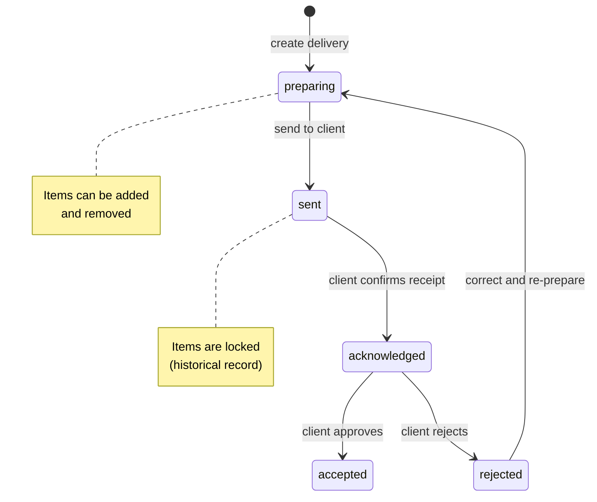

### Entities

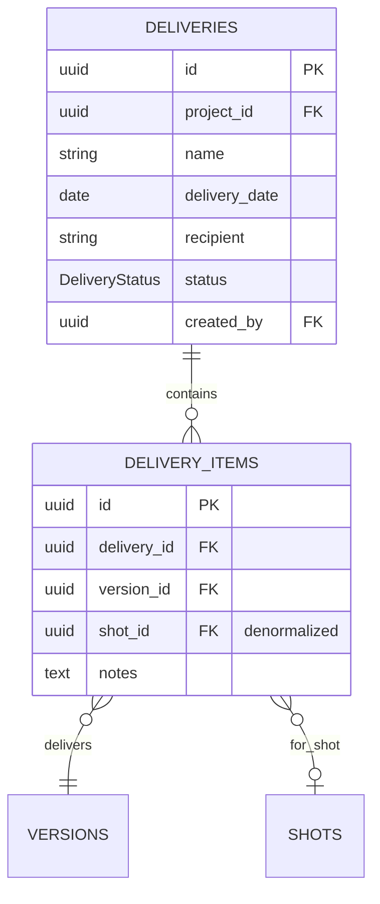

### Item locking rule

Items can only be added or removed when status is `preparing`. Once the delivery moves to `sent`, items are locked as a historical record.

### Key endpoints

```
POST   /projects/{id}/deliveries
GET    /projects/{id}/deliveries?status=sent
GET    /deliveries/{id}
PATCH  /deliveries/{id}
PATCH  /deliveries/{id}/status
DELETE /deliveries/{id}

POST   /deliveries/{id}/items
GET    /deliveries/{id}/items
DELETE /deliveries/{id}/items/{item_id}
```
