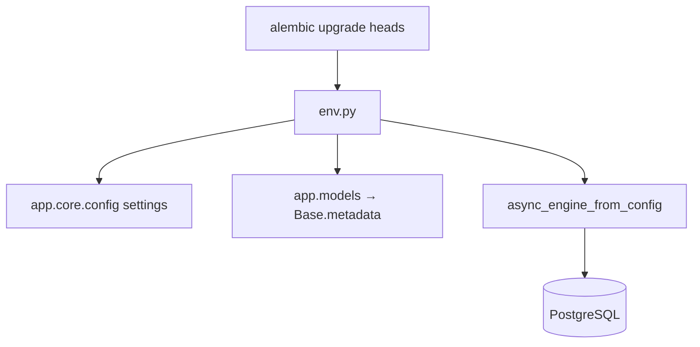
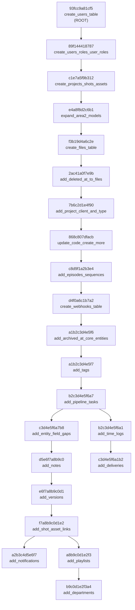
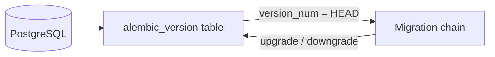
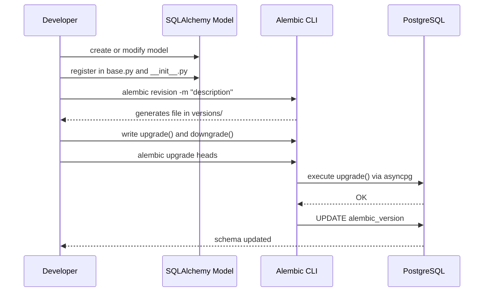

# Alembic Migrations

## What Alembic does in this repo

Alembic is the database schema migration system. Every change to SQLAlchemy models that needs to be reflected in PostgreSQL is written as a migration file.

Migrations live in `backend/alembic/versions/` and are applied in order through a chain of revisions.

---

## File structure

```
alembic.ini                        ← main configuration
backend/alembic/
  env.py                           ← async execution environment
  script.py.mako                   ← template for new migrations
  versions/                        ← one migration per file
    93fcc9a81cf5_create_users_table.py
    89f144418787_create_users_roles_user_roles.py
    ...
```

---

## How env.py works

`env.py` is the heart of the migration system. It does three key things:

1. **Injects the database URL** from `settings.database_url` (not from `alembic.ini`), normalizing it to `postgresql+asyncpg://`.
2. **Registers all models** by importing `app.models`, which loads their definitions into `Base.metadata`.
3. **Runs migrations asynchronously** using `async_engine_from_config` + `asyncio.run`.



---

## Anatomy of a migration file

Each migration file has this structure:

```python
"""short description"""

revision: str = "a1b2c3d4e5f6"       # unique ID of this migration
down_revision: str | None = "prev123" # ID of previous migration (None = first ever)
branch_labels = None
depends_on = None

def upgrade() -> None:
    # Changes to apply (create table, add column, create enum...)
    op.create_table("my_table", ...)

def downgrade() -> None:
    # Reverse the upgrade() changes
    op.drop_table("my_table")
```

The chain `down_revision → revision → next revision` forms the migration graph.

---

## Current migration chain



> **Note:** There are two branches leaving `b2c3d4e5f6a7` (add_pipeline_tasks) and two leaving `f7a8b9c0d1e2` (add_shot_asset_links). Alembic calls these **branches**. To apply all branches use `alembic upgrade heads` (plural).

---

## Essential commands

```bash
# Apply all pending migrations
alembic upgrade head         # if there is a single head
alembic upgrade heads        # if there are multiple branches (this repo)

# Roll back the last migration
alembic downgrade -1

# Show current applied revision(s)
alembic current

# Show full history
alembic history --verbose

# Show active heads (if branches exist)
alembic heads

# Create a new manual migration
alembic revision -m "add_new_table"

# Create a migration auto-detecting model changes
alembic revision --autogenerate -m "add_new_table"
```

### Inside Docker

```bash
docker compose exec api alembic upgrade heads
docker compose exec api alembic current
docker compose exec api alembic history --verbose
```

---

## How the alembic_version table works

Alembic maintains a table called `alembic_version` in PostgreSQL that records which revisions are currently applied:

```sql
SELECT * FROM alembic_version;
-- version_num
-- f7a8b9c0d1e2
-- b9c0d1e2f3a4
-- c3d4e5f6a1b2
```

When there are multiple branches, there can be multiple rows at the same time — one per active head.



---

## How to create a new migration in this repo

### 1. Create or modify the SQLAlchemy model

```python
# backend/app/models/my_entity.py
class MyEntity(Base):
    __tablename__ = "my_entity"
    id: Mapped[uuid.UUID] = mapped_column(Uuid, primary_key=True, default=uuid.uuid4)
    name: Mapped[str] = mapped_column(String(100), nullable=False)
```

### 2. Register the model in base.py and models/__init__.py

```python
# backend/app/db/base.py
from app.models.my_entity import MyEntity  # noqa: F401

# backend/app/models/__init__.py
from app.models.my_entity import MyEntity
__all__ = [..., "MyEntity"]
```

### 3. Create the migration file

**Option A — manual** (recommended for full control):

```bash
alembic revision -m "add_my_entity"
```

Edit the generated file and write `upgrade()` and `downgrade()` by hand.

**Option B — autogenerate** (useful as a starting point):

```bash
alembic revision --autogenerate -m "add_my_entity"
```

Always review the generated file. Autogenerate does not detect everything — PostgreSQL enums in particular must be created manually.

### 4. Verify the revision chain

The `down_revision` in the new file must point to the current head:

```python
revision: str = "new_id_here"
down_revision: str | None = "c3d4e5f6a1b2"  # the current head
```

### 5. Apply

```bash
alembic upgrade heads
```

---

## PostgreSQL enums in migrations

PostgreSQL enums require explicit creation and deletion. The pattern used in this repo:

```python
def upgrade() -> None:
    # Create the enum first
    my_enum = postgresql.ENUM("val1", "val2", name="myenum")
    my_enum.create(op.get_bind(), checkfirst=True)

    # Then create the table that uses it
    op.create_table("my_table",
        sa.Column("status", sa.Enum(name="myenum", create_type=False), ...),
    )

def downgrade() -> None:
    op.drop_table("my_table")
    op.execute("DROP TYPE IF EXISTS myenum")
```

---

## Repo conventions

| Convention | Detail |
|-----------|--------|
| File naming | `{revision_id}_{description}.py` |
| Revision IDs | 12 hex characters |
| `down_revision = None` | Only in the root migration (`create_users_table`) |
| Enums | Always `checkfirst=True` on `create`, `IF EXISTS` on `DROP` |
| UUID columns | `postgresql.UUID()` in migrations, `Uuid` in models |
| Indexes | Create explicitly in `upgrade()`, drop in `downgrade()` |

---

## Full schema change flow


