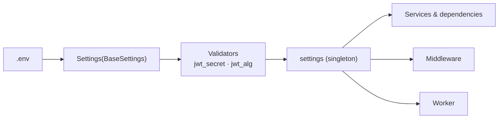

# Configuration and Environment Variables

All Pipeline Production Hub configuration is centralized in `backend/app/core/config.py` using Pydantic Settings. Values are loaded from a `.env` file at the project root.

---

## How It Works

The `Settings` class inherits from pydantic-settings `BaseSettings`. When `Settings()` is instantiated, Pydantic:

1. Reads the `.env` file (UTF-8 encoding, case-insensitive)
2. Applies custom validators (`@field_validator`)
3. Exports a `settings` singleton importable from any module

---

## Variable Reference

### App

| Variable | Type | Default | Validation | Description |
|----------|------|---------|------------|-------------|
| `APP_ENV` | str | `development` | — | Runtime environment |
| `CORS_ORIGINS` | str | `*` | — | Comma-separated list of allowed CORS origins |

### Database

| Variable | Type | Default | Validation | Description |
|----------|------|---------|------------|-------------|
| `DATABASE_URL` | str | `""` | — | PostgreSQL connection URL |

### Redis

| Variable                          | Type | Default                    | Validation | Description                   |
| --------------------------------- | ---- | -------------------------- | ---------- | ----------------------------- |
| `REDIS_URL`                       | str  | `redis://localhost:6379/0` | —          | Redis connection URL          |
| `TASK_QUEUE_NAME`                 | str  | `tasks:queue:default`      | —          | Task queue name               |
| `TASK_STATUS_TTL_SECONDS`         | int  | `86400`                    | `≥ 60`     | Task status TTL (seconds)     |
| `METRICS_ACTIVE_USERS_WINDOW_MIN` | int  | `15`                       | `1–1440`   | Active users window (minutes) |

### JWT

| Variable                    | Type | Default | Validation              | Description                       |
| --------------------------- | ---- | ------- | ----------------------- | --------------------------------- |
| `JWT_SECRET`                | str  | `""`    | Non-empty (validator)   | Secret key for token signing      |
| `JWT_ALG`                   | str  | `HS256` | 12 supported algorithms | JWT signing algorithm             |
| `ACCESS_TOKEN_EXPIRE_MIN`   | int  | `30`    | —                       | Access token expiration (minutes) |
| `REFRESH_TOKEN_EXPIRE_DAYS` | int  | `7`     | —                       | Refresh token expiration (days)   |

### Authentication

| Variable | Type | Default | Validation | Description |
|----------|------|---------|------------|-------------|
| `BCRYPT_ROUNDS` | int | `12` | `4–31` | Bcrypt hashing rounds |
| `LOGIN_RATE_LIMIT_MAX_ATTEMPTS` | int | `5` | `1–100` | Max failed login attempts before block |
| `LOGIN_RATE_LIMIT_WINDOW_MIN` | int | `15` | `1–1440` | Login rate limit window (minutes) |

### Global API Rate Limiting

Applied to all routes except `/health`, `/metrics`, `/docs`, `/redoc`, `/openapi.json`.

| Variable | Type | Default | Validation | Description |
|----------|------|---------|------------|-------------|
| `RATE_LIMIT_ENABLED` | bool | `true` | — | Enable or disable the rate limiter |
| `RATE_LIMIT_MAX_REQUESTS` | int | `120` | `≥ 1` | Max requests per window |
| `RATE_LIMIT_WINDOW_SECONDS` | int | `60` | `≥ 1` | Fixed-window duration (seconds) |

### Storage

| Variable | Type | Default | Validation | Description |
|----------|------|---------|------------|-------------|
| `STORAGE_BACKEND` | str | `local` | — | Storage backend (`local` or `s3`) |
| `LOCAL_STORAGE_ROOT` | str | `./data/storage` | — | Root path for local storage |
| `STORAGE_URL_EXPIRES_DEFAULT` | int | `3600` | `≥ 1` | Pre-signed URL expiration (seconds) |
| `STORAGE_MAX_UPLOAD_SIZE_BYTES` | int | `1073741824` (1 GB) | `≥ 1` | Max upload size |
| `PROJECT_EXPORT_ASYNC_THRESHOLD_ENTITIES` | int | `1000` | `≥ 1` | Async export threshold |

### S3 / MinIO

| Variable | Type | Default | Validation | Description |
|----------|------|---------|------------|-------------|
| `S3_ENDPOINT_URL` | str | `""` | — | S3/MinIO endpoint URL |
| `S3_ACCESS_KEY` | str | `""` | — | S3 access key |
| `S3_SECRET_KEY` | str | `""` | — | S3 secret key |
| `S3_BUCKET` | str | `vfxhub` | — | Bucket name |

---

## Custom Validators

### `jwt_secret`
Verifies the value is not empty after `.strip()`. If empty, raises `ValueError` preventing application startup.

### `jwt_alg`
Validates against 12 supported algorithms: `HS256`, `HS384`, `HS512`, `RS256`, `RS384`, `RS512`, `ES256`, `ES384`, `ES512`, `PS256`, `PS384`, `PS512`.

---

## Docker vs Local

| Context | `DATABASE_URL` | `REDIS_URL` |
|---------|---------------|-------------|
| Docker Compose | `postgresql://...@db:5432/vfxhub` | `redis://redis:6379/0` |
| Local | `postgresql://...@localhost:5432/vfxhub` | `redis://localhost:6379/0` |

The difference is the hostname: Docker uses service names (`db`, `redis`), while local development uses `localhost`.
