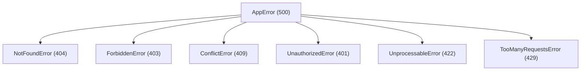
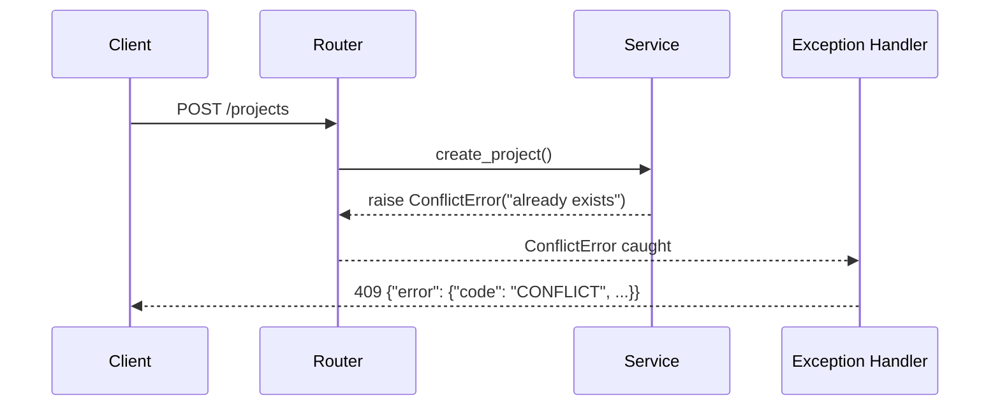

# Error Handling and API Conventions

Pipeline Production Hub defines a custom exception hierarchy and a consistent error response format. All exceptions are handled centrally in `backend/app/core/exceptions.py`.

---

## Exception Hierarchy



Each subclass defines `status_code` and `error_code` as class attributes. The constructor accepts `detail` (message) and `data` (context dictionary).

---

## Error Response Format

All error responses follow the same JSON format:

```json
{
  "error": {
    "code": "NOT_FOUND",
    "message": "Resource not found.",
    "detail": {}
  }
}
```

| Field | Type | Description |
|-------|------|-------------|
| `code` | string | Error code in UPPER_SNAKE_CASE |
| `message` | string | Human-readable error message |
| `detail` | object | Additional context (empty by default) |

---

## Exception Reference

| Exception | HTTP | Code | Use Case |
|-----------|------|------|----------|
| `NotFoundError` | 404 | `NOT_FOUND` | Resource not found |
| `UnauthorizedError` | 401 | `UNAUTHORIZED` | Invalid or missing token |
| `ForbiddenError` | 403 | `FORBIDDEN` | Insufficient permissions |
| `ConflictError` | 409 | `CONFLICT` | Duplicate resource or state conflict |
| `UnprocessableError` | 422 | `UNPROCESSABLE` | Unprocessable entity |
| `TooManyRequestsError` | 429 | `TOO_MANY_REQUESTS` | Rate limit exceeded |
| `RequestValidationError` | 422 | `VALIDATION_ERROR` | Pydantic validation error |

---

## Handler Registration

Exception handlers are registered in `main.py` via `register_exception_handlers(app)`. Each exception type has a dedicated handler, plus handlers for FastAPI validation errors and Starlette HTTP exceptions.



---

## Pagination Conventions

Pagination uses `offset/limit` defined in `PaginationParams`:

| Parameter | Default | Range | Description |
|-----------|---------|-------|-------------|
| `offset` | `0` | `≥ 0` | Records to skip |
| `limit` | `20` | `1–100` | Records per page |

Responses include `PaginationMeta` with `offset`, `limit`, and `total`.

---

## Route Conventions

- **Nested routes**: `/projects/{id}/shots`, `/shots/{id}/notes`
- **Status filtering**: query parameters (`status`, `type`)
- **Project scoping**: most entities are accessed under `/projects/{id}/...`
- **Direct routes**: also available for individual entity operations (`/shots/{id}`, `/assets/{id}`)
