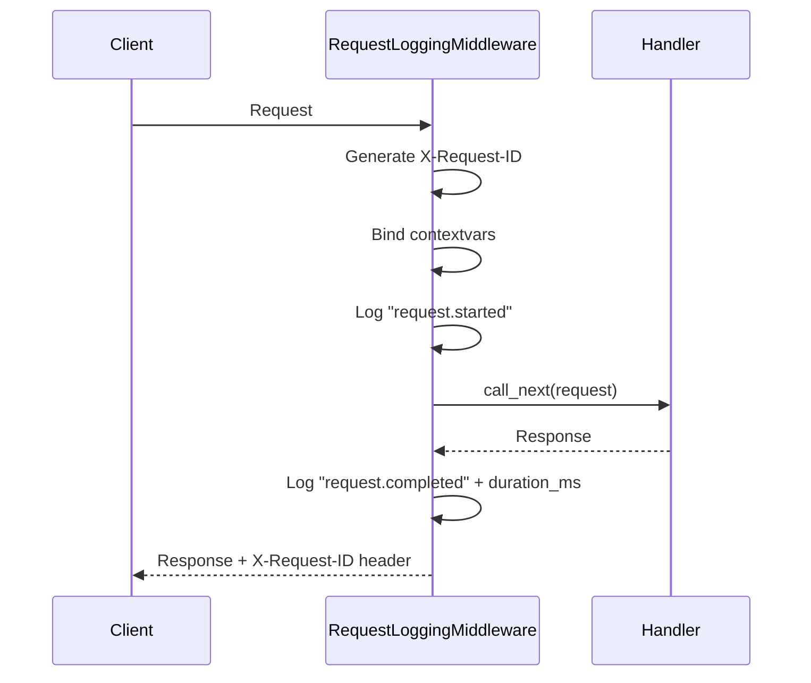
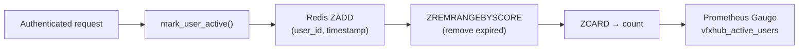

		# Observability

Pipeline Production Hub implements structured logging, request tracing, and Prometheus metrics for production monitoring.

---

## Structured Logging

Configured in `backend/app/core/logging.py` using **structlog** with JSON output.

### Processor Chain

| Order | Processor | Purpose |
|-------|-----------|---------|
| 1 | `merge_contextvars` | Merges context variables (request_id, method, path) |
| 2 | `add_log_level` | Adds `level` field |
| 3 | `add_logger_name` | Adds logger name |
| 4 | `TimeStamper(fmt="iso", utc=True)` | ISO 8601 timestamp in UTC |
| 5 | `StackInfoRenderer` | Stack trace if applicable |
| 6 | `format_exc_info` | Formats exceptions |
| 7 | `JSONRenderer` | Final JSON output |

Example output:
```json
{
  "request_id": "a1b2c3d4",
  "http_method": "GET",
  "http_path": "/projects",
  "level": "info",
  "event": "request.completed",
  "status_code": 200,
  "duration_ms": 12.5,
  "timestamp": "2026-03-16T10:00:00Z"
}
```

---

## Request Logging Middleware

`RequestLoggingMiddleware` in `backend/app/api/middleware/request_logging.py` intercepts every request:

1. Generates or reuses `X-Request-ID` (UUID)
2. Binds contextvars: `request_id`, `http_method`, `http_path`
3. Logs `request.started` with `client_ip`
4. Executes the handler
5. Logs `request.completed` with `status_code` and `duration_ms`
6. Adds `X-Request-ID` header to the response
7. Clears contextvars



On exception, `request.failed` is logged with `duration_ms` and the exception is re-raised.

---

## Rate Limit Middleware

`RateLimitMiddleware` in `backend/app/api/middleware/rate_limit.py` applies a fixed-window rate limiter on every non-exempt route.

Identity is resolved per request:

- authenticated requests: `user:{sub}` (extracted from Bearer token).
- unauthenticated requests: `ip:{client_host}`.

Every response — allowed or rejected — gets three headers:

| Header | Description |
|--------|-------------|
| `X-RateLimit-Limit` | Max requests in the current window |
| `X-RateLimit-Remaining` | Remaining requests in the window |
| `X-RateLimit-Reset` | Seconds until the window resets |

When the limit is exceeded the middleware returns `429 Too Many Requests` with a `Retry-After` header and the following JSON body:

```json
{
  "error": {
    "code": "TOO_MANY_REQUESTS",
    "message": "Rate limit exceeded",
    "detail": {
      "limit": 120,
      "window_seconds": 60,
      "retry_after_seconds": 45
    }
  }
}
```

If Redis is unavailable the middleware fails open — the request proceeds normally.

---

## Prometheus Metrics

Configured in `backend/app/core/metrics.py` using `prometheus_fastapi_instrumentator`.

### Configuration

| Option | Value | Description |
|--------|-------|-------------|
| `should_group_status_codes` | `True` | Groups status codes (2xx, 4xx, 5xx) |
| `should_ignore_untemplated` | `False` | Instruments untemplated routes |
| `should_instrument_requests_inprogress` | `True` | In-progress requests gauge |
| `excluded_handlers` | `["/metrics"]` | Excludes the metrics endpoint itself |

The `/metrics` endpoint exposes metrics in Prometheus format.

---

## Active Users

`backend/app/core/active_users.py` tracks authenticated users using a Redis sorted set.

### How It Works

1. `mark_user_active(user_id)` is called on every authenticated request
2. Redis `ZADD` with timestamp as score on key `metrics:active_users:last_seen`
3. `ZREMRANGEBYSCORE` cleans entries outside the window (configurable, default 15 min)
4. `ZCARD` counts active users
5. Exported as Prometheus gauge `vfxhub_active_users`



The operation is fire-and-forget: if Redis fails, the request continues normally.
