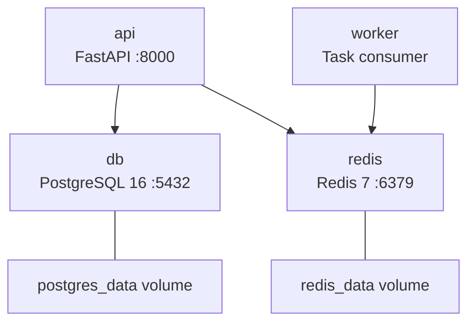

# Docker and Development

Complete guide for running Pipeline Production Hub with Docker and in local development.

---

## Docker Services



| Service | Image | Port | Healthcheck | Volume |
|---------|-------|------|-------------|--------|
| `db` | `postgres:16-alpine` | 5432 | `pg_isready` | `postgres_data` |
| `redis` | `redis:7-alpine` | 6379 | `redis-cli ping` | `redis_data` |
| `api` | Local build (Dockerfile) | 8000 | — | `.:/app` (bind mount) |
| `worker` | Local build (Dockerfile) | — | — | `.:/app` (bind mount) |

### Dependencies

- `api` depends on `db` (healthy) and `redis` (healthy)
- `worker` depends on `redis` (healthy)

---

## Quick Start

```bash
# 1. Clone and configure
git clone <repo-url>
cd pipeline-production-hub-dev
cp .env.example .env

# 2. Start services
docker compose up --build

# 3. Verify
# API: http://localhost:8000/docs
# Health: http://localhost:8000/health
```

---

## Demo Seed Data

```bash
docker compose exec api python -m app.scripts.seed
```

The seed script creates:
- 5 system roles (`admin`, `supervisor`, `lead`, `artist`, `worker`)
- Admin user (configurable via `SEED_ADMIN_EMAIL` / `SEED_ADMIN_PASSWORD`)
- Demo project (configurable via `SEED_DEMO_PROJECT_NAME` / `SEED_DEMO_PROJECT_CODE`)
- 3 sample shots and 3 sample assets

The seed is **idempotent**: running multiple times does not duplicate data.

---

## Dockerfile

Multi-stage build with Python 3.11:

| Stage | Purpose |
|-------|---------|
| `builder` | Installs dependencies with gcc/libpq-dev for C extension compilation (asyncpg) |
| `runtime` | Slim final image with only installed packages and application source |

---

## Local Development (without Docker)

Requires PostgreSQL and Redis installed locally.

```bash
# Install dependencies
pip install -e ".[dev,test]"

# Configure variables (change hostnames to localhost)
cp .env.example .env
# Edit DATABASE_URL: @localhost:5432
# Edit REDIS_URL: redis://localhost:6379/0

# Run
uvicorn backend.app.main:app --reload
```

---

## Code Quality

Pipeline Production Hub uses **Hatch** as environment manager:

| Command | Action |
|---------|--------|
| `hatch run lint` | `ruff check .` |
| `hatch run fmt` | `ruff format .` |
| `hatch run types` | `mypy backend` |
| `hatch run test` | pytest with coverage (80% threshold) |
| `hatch run check` | lint + types + test |

---

## Tests

```bash
# All tests
docker compose exec api python -m pytest -v

# With coverage
docker compose exec api python -m pytest -v --cov=backend

# Specific file
docker compose exec api python -m pytest -v test/test_auth.py
```

---

## Troubleshooting

| Problem | Solution |
|---------|----------|
| Port 5432/6379/8000 in use | Stop the service using the port or change the mapping in `docker-compose.yml` |
| DB not ready | Check `db` healthcheck; `docker compose logs db` for errors |
| `JWT_SECRET must be set` | Ensure `.env` has `JWT_SECRET` with a non-empty value |
| Corrupted persistent data | `docker compose down -v` to clean volumes and recreate |
| Code changes not reflected | Bind mount and `--reload` should detect changes; verify files are saved |
