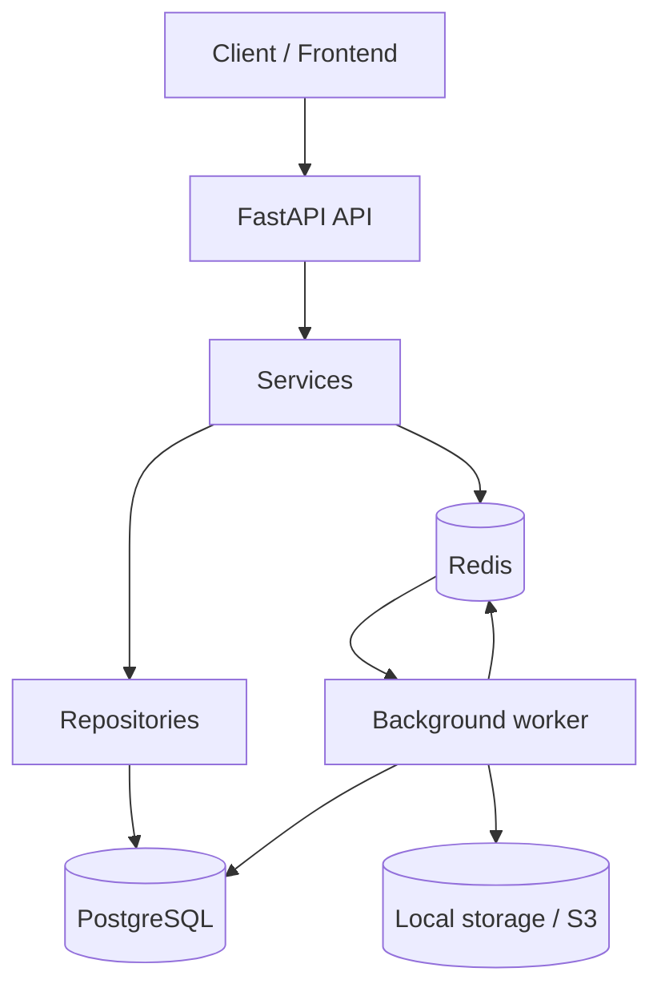
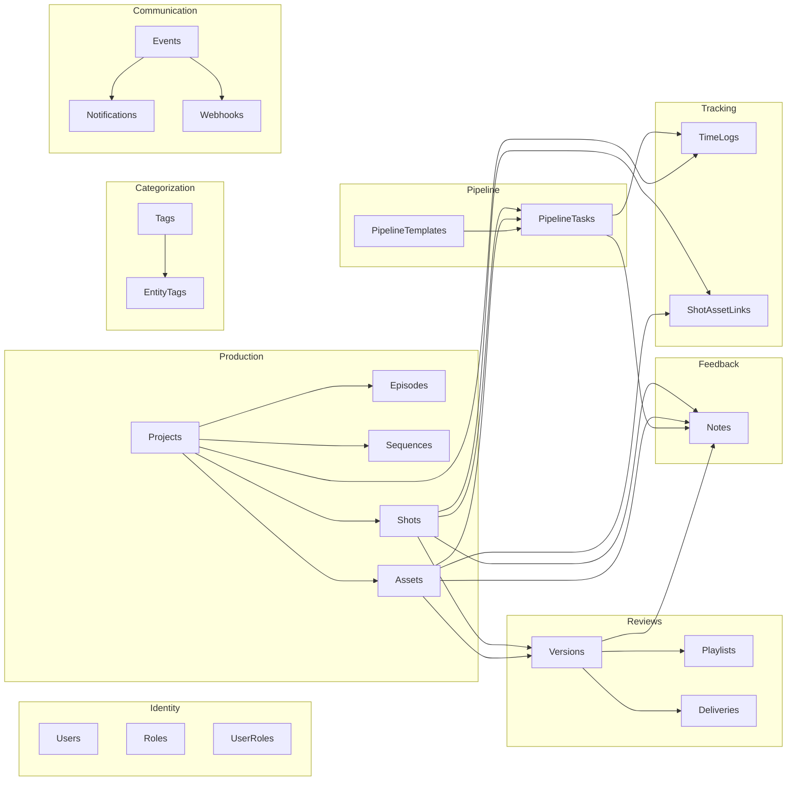

# Architecture Docs

English architecture documentation for Pipeline Production Hub.

This folder is the canonical technical reference for the repository. Files are numbered to reflect reading order and should stay in English only.

## Documents

| # | File | Contents |
|---|------|----------|
| 01 | [01-overview.md](./01-overview.md) | System overview, implemented domains, request and async task flows |
| 02 | [02-backend-layers.md](./02-backend-layers.md) | Routers, services, repositories, core utilities |
| 03 | [03-postgresql.md](./03-postgresql.md) | Full data model, entity map, constraints |
| 04 | [04-redis.md](./04-redis.md) | Task queue, token blacklist, rate limit, active users |
| 05 | [05-auth-rbac.md](./05-auth-rbac.md) | JWT auth, refresh/logout, role-based access control |
| 06 | [06-files-storage.md](./06-files-storage.md) | Upload, download, versioning, checksum, storage backends |
| 07 | [07-background-jobs-webhooks.md](./07-background-jobs-webhooks.md) | Worker, task types, webhook signing and delivery |
| 08 | [08-production-features.md](./08-production-features.md) | Pipeline tasks, notes, versions, shot-asset links, playlists, departments, notifications, tags, timelogs, deliveries |
| 09 | [09-alembic-migrations.md](./09-alembic-migrations.md) | Migration chain, env.py, commands, enum patterns, conventions |
| 10 | [10-configuration.md](./10-configuration.md) | Environment variables, Pydantic Settings, validators, full config reference |
| 11 | [11-error-handling-api-conventions.md](./11-error-handling-api-conventions.md) | Exception hierarchy, JSON error format, pagination, route conventions |
| 12 | [12-observability.md](./12-observability.md) | Structured logging, request middleware, Prometheus metrics, active users |
| 13 | [13-docker-development.md](./13-docker-development.md) | Docker services, quick start, seed data, local development, troubleshooting |

## Conventions

- Keep numbering continuous and unique.
- Add at least one Mermaid diagram to each architecture doc.
- Update this index whenever a numbered architecture doc is added, renamed, or removed.
- Keep architecture content here instead of creating mirrored copies elsewhere in `docs/`.

## System map

## Domain overview

## Docker services

| Service | Description | Port |
|---------|-------------|------|
| `api` | FastAPI application | 8000 |
| `db` | PostgreSQL 16 | 5432 |
| `redis` | Redis 7 | 6379 |
| `worker` | Background task consumer | — |
