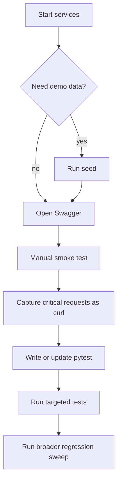

# Testing Workflow

This guide defines the recommended order for testing the current backend without getting stuck switching randomly between Swagger, `curl`, and automated tests.

---

## Goal

Use each tool for the job it is best at:

- **Seed data** for fast manual exploration
- **Swagger** for interactive smoke testing and payload discovery
- **`curl`** for reproducible manual request flows
- **`pytest`** for real regression coverage and "done" status

---

## Recommended Order



---

## Step 1: Start the stack

```bash
docker compose up --build
```

Check:

- API docs: `http://localhost:8000/docs`
- Health endpoint: `http://localhost:8000/health`

---

## Step 2: Decide whether to seed

Use seed data when you want to explore flows manually in Swagger without creating every dependency by hand.

```bash
docker compose exec api python -m app.scripts.seed
```

Use seed data for:

- Swagger exploration
- checking list endpoints quickly
- validating role-protected flows with existing demo entities

Do **not** rely on seed data for automated tests. `pytest` should create its own state and stay deterministic.

---

## Step 3: Use Swagger first for smoke testing

Swagger is the fastest way to validate that an endpoint basically works.

Use it for:

- request/response shape
- required fields
- enum values
- auth header behavior
- quick happy-path verification

Swagger is **not** your final proof that a feature is solid. It is the fastest feedback loop, not the source of truth.

For each new endpoint, verify in Swagger:

1. happy path
2. missing field / bad payload
3. unauthorized request
4. forbidden request if RBAC applies
5. not found case if the endpoint reads by ID

---

## Step 4: Save important flows as `curl`

After Swagger, keep the most important calls as `curl` commands so you can rerun them quickly without clicking through the UI.

Use `curl` for:

- login and token reuse
- multipart/file upload debugging
- exact header reproduction
- sharing a failing request with future-you

Typical sequence:

1. login
2. copy the access token
3. call the protected endpoint with `Authorization: Bearer ...`
4. save the command in your notes while the endpoint is unstable

---

## Step 5: Add or update `pytest`

`pytest` is what makes an endpoint "closed" enough to move on.

Run targeted tests:

```bash
docker compose exec api python -m pytest -v test/test_auth.py
docker compose exec api python -m pytest -v test/
```

When you add a new endpoint, the minimum automated coverage should include:

- happy path
- validation error
- unauthorized / forbidden path if protected
- not found or conflict case when relevant
- one assertion about persisted side effects when the endpoint writes to the database

---

## Priority Order for What to Test Now

### P0: Core access and identity

Test first because everything else depends on these working correctly:

- health endpoints
- auth login / refresh / logout
- RBAC / role-protected access
- users endpoints now being added

### P1: Core production entities

These unlock most day-to-day backend work:

- projects
- episodes
- sequences
- shots
- assets
- files

### P2: Workflow entities

Test once the core hierarchy is reliable:

- pipeline tasks
- time logs
- tags
- notes
- notifications
- departments

### P3: Review and delivery flows

Do these after the previous layers are stable:

- versions
- playlists
- deliveries
- webhooks
- metrics

---

## Practical Rule Per Endpoint

Before moving to another feature, close this checklist:

- endpoint works in Swagger
- one or two critical flows are reproducible with `curl`
- automated tests exist for the main path and failure paths
- docs are updated if the contract changed
- migration is applied if schema changed

If one of these is still missing, the endpoint is not really done.

---

## Recommended Working Rhythm

For each endpoint or small feature:

1. implement the endpoint
2. smoke test in Swagger
3. save one `curl` for the key flow
4. write/update `pytest`
5. run targeted tests
6. only then continue

This keeps momentum without losing confidence.

---

## Short Advice

- Use **Swagger** first.
- Use **`curl`** second.
- Use **`pytest`** as the final gate.
- Use **seed data** only for manual exploration, not as your testing foundation.
